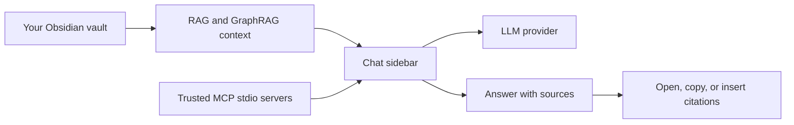

# Superpower Inside


> **Desktop AI copilot for Obsidian.** Chat with LLMs, search your vault with RAG and GraphRAG, call trusted MCP tools, and keep source-aware answers close to your notes.

Superpower Inside is built for people who use Obsidian as a working knowledge base. The plugin should feel quiet and competent: connect the pieces once, ask in natural language, and let the assistant prepare context, sources, and tool results without turning daily note work into system maintenance.

| What it helps with | How it works |
| --- | --- |
| Find answers in your vault | Uses local indexes and graph-aware context when they are available |
| Work with sources | Shows source cards, evidence, and citation actions beside the answer |
| Use your preferred model | Pick a model first, then let Superpower Inside prepare the matching provider profile |
| Extend the assistant | Lets a trusted local MCP stdio server help when you mention it |

> [!IMPORTANT]
> Superpower Inside is **desktop-only**. It depends on desktop Obsidian features such as MCP stdio servers, local Ollama support, and local runtime path handling. Mobile Obsidian is not supported.
> The plugin is free and open source. There is no premium tier, lock-in feature, or revenue-based product wall in plugin code.

## Quick Look



## Features

| Feature | Description |
| --- | --- |
| Chat sidebar | Ask questions without leaving Obsidian. |
| Vault RAG | Finds relevant Markdown context with vector, keyword, and structural retrieval paths. |
| GraphRAG | Uses local graph evidence for entity, relation, theme, and source-backed questions. |
| File and folder mentions | Attach exact notes or folders with `@file.md` or `@[folder/path]`. |
| MCP mentions | Use `@server` when you want a trusted MCP server to help. |
| Source cards | Open source notes, copy Obsidian links, and insert citations into the active note. |
| Chat history | Save and reopen useful research sessions inside your vault. |
| Model-centered providers | Choose ready-made or custom model profiles for chat, embedding, and graph extraction without hand-tuning every provider field. |
| Built-in local embeddings | Use Ternlight on-device embeddings without an API key, Ollama server, or per-call network request. |
| Agent diagnostics | Shows readable runtime diagnosis, recent operations, event logs, and a safe-mode recovery action when plugin startup or indexing gets stuck. |

## Install

### Community Plugin Directory

1. Open **Settings -> Community plugins** in Obsidian.
2. Search for **Superpower Inside**.
3. Install and enable the plugin.
4. Open the plugin settings and connect a provider.

### Manual Install

1. Download the latest release from [GitHub Releases](https://github.com/magnitus99/Superpower-Inside/releases).
2. Copy `manifest.json`, `main.js`, `styles.css`, and `tern_engine_bg.wasm` into `.obsidian/plugins/superpower-inside/`.
3. Reload community plugins in Obsidian.
4. Enable **Superpower Inside**.

## First Setup

Choose the model profile you want to use first. Superpower Inside fills in the matching provider shape for chat, embedding, and graph extraction, while still letting you adjust advanced fields when a custom endpoint needs them. If you use local Ollama, set the local base URL and model. If you use a remote provider, add the API key in Obsidian's local plugin storage.

Ternlight is always available as the built-in embedding option and is the default for new installations. It runs entirely on this device. If its WASM model file is missing, Superpower Inside downloads the asset for the installed plugin version from this repository's GitHub Release, verifies its size and SHA-256 checksum, and then reuses it offline.

After that, open the chat sidebar and ask a question. When RAG or GraphRAG needs preparation, Superpower Inside shows the current state and the next useful action instead of making you manage index files directly. Manual actions such as reindexing, retrying failed graph extraction, or resetting graph data stay available for recovery, but they are not the normal workflow.

## Everyday Use

### Chat With Your Vault

Ask natural questions in the sidebar. When RAG is enabled, Superpower Inside attaches relevant note context before the model answers. When GraphRAG is enabled, graph evidence can also help answer questions about entities, relationships, themes, and source-backed claims.

```text
Summarize my notes about active projects.
What did I write about retrieval-augmented generation last month?
Find contradictions between my planning notes and meeting notes.
```

### Attach Exact Context

Use mentions when a question needs a specific source.

| Mention | Meaning |
| --- | --- |
| `@note.md` | Attach a note by path or name. |
| `@[folder/path]` | Attach Markdown notes from a folder. |
| `@server` | Attach and use a trusted MCP server. |

### Work With Sources

Source cards show where an answer came from. You can open the source note, copy an Obsidian link, or insert a citation into the active note.

### Save Chat Sessions

Chats can be saved as Markdown files in your configured chat folder. This keeps research trails, source metadata, and useful answers inside the vault.

### Let Indexes Stay Out Of The Way

RAG and GraphRAG maintain local state for this vault. When notes, models, or graph evidence need attention, the settings view surfaces a clear status and the smallest next action. The goal is not to make you operate an index dashboard; it is to keep answers grounded while staying out of your way.

Superpower Inside reuses compatible local index data and works through missing or stale coverage in small background batches after startup. Interrupted work keeps its partial progress and resumes automatically, while oversized or binary sources never monopolize the app, so reindexing stays a recovery tool rather than routine maintenance.

GraphRAG extraction uses one concurrent model request by default. If your provider supports more throughput, the GraphRAG settings let you raise the concurrent request count from 1 to 10 while keeping the current value visible beside the slider.

### Recover From Startup Problems

The Agent Diagnostics view writes a local JSON snapshot and append-only event log while the plugin runs. If Obsidian reopens after a stuck startup, white screen, indexing hang, or MCP connection stall, the view highlights the last visible operation, the likely cause, and a safe-mode action that reopens the plugin with heavy indexing disabled.

<details>
<summary><strong>Security and data access</strong></summary>

- Settings and API keys are stored in this device's Obsidian local storage and are not newly saved to the synced plugin `data.json` file.
- Chat messages, selected notes, retrieved RAG chunks, tool arguments, and tool results may be sent to the configured LLM, embedding provider, or MCP server.
- RAG and GraphRAG features enumerate Markdown files in the vault to build and refresh local indexes.
- Vector and graph indexes are stored locally in Obsidian's browser storage for this vault.
- Citation actions and copy buttons write text to the system clipboard.
- MCP stdio launches local commands that you configure. Only add MCP servers you trust.
- When you mention an MCP server with `@server`, Superpower Inside treats that mention as intent to use the trusted server and may auto-run non-destructive model-requested tools from it. Tool arguments and results may be sent back to the configured LLM provider to generate the final answer.
- Local Ollama and local MCP servers can run on your machine, but provider settings may still send data over the network.
- If the built-in Ternlight model file is missing, the plugin downloads `tern_engine_bg.wasm` once from the matching Superpower Inside GitHub Release and verifies it before execution. No note content is included in this download request.

</details>

## Documentation

| Document | Purpose |
| --- | --- |
| [Developer guide](docs/README_FOR_DEV.md) | Current architecture, product gate, and change workflow |
| [Development setup](docs/DEV_SETUP.md) | Test vault, hot reload, and Obsidian debug setup |

## 한국어 안내

> **Obsidian 데스크톱용 AI 코파일럿.** LLM 채팅, 볼트 RAG/GraphRAG 검색, 신뢰한 MCP 도구 호출, 출처 기반 답변을 노트 작업 흐름 안에서 제공합니다.

Superpower Inside는 Obsidian을 실제 지식 작업 공간으로 쓰는 사람을 위한 플러그인입니다. 한 번 연결해 두면 질문, 컨텍스트 준비, 출처 확인, 필요한 인용 삽입이 한 화면 안에서 조용히 이어지도록 설계합니다.

| 도움이 되는 일 | 작동 방식 |
| --- | --- |
| 볼트에서 답 찾기 | 사용 가능한 로컬 인덱스와 graph-aware 컨텍스트를 활용 |
| 출처 확인하기 | 답변 아래 출처 카드와 evidence를 보여주고 노트로 다시 삽입 |
| 원하는 모델 쓰기 | OpenAI, Claude, Ollama, OpenRouter, Ollama Cloud, 커스텀 OpenAI-compatible provider 지원 |
| 도구 확장하기 | 신뢰한 로컬 MCP stdio 서버를 필요할 때 연결 |

> [!IMPORTANT]
> Superpower Inside는 **데스크톱 전용**입니다. MCP stdio 서버, 로컬 Ollama, 데스크톱 런타임 경로 처리를 사용하므로 모바일 Obsidian은 지원하지 않습니다.
> 본 플러그인은 무료 오픈소스 프로젝트를 전제로 유지되며, 유료 구독/기능 잠금 같은 수익화 경로를 플러그인 코드에 추가하지 않습니다.

## 주요 기능

| 기능 | 설명 |
| --- | --- |
| 사이드바 채팅 | Obsidian을 떠나지 않고 AI와 대화합니다. |
| 볼트 RAG | 벡터, 키워드, 구조 기반 검색으로 Markdown 노트의 관련 청크를 모델 컨텍스트로 보냅니다. |
| GraphRAG | 노트에서 만든 로컬 지식 그래프로 entity, relation, evidence, community 기반 컨텍스트를 제공합니다. |
| 파일/폴더 멘션 | `@file.md`, `@[folder/path]`로 특정 노트나 폴더를 붙입니다. |
| MCP 멘션 | `@server`로 신뢰한 MCP 서버를 사용합니다. |
| 출처 카드 | 출처 열기, Obsidian 링크 복사, 활성 노트에 인용 삽입을 지원합니다. |
| 채팅 저장 | 채팅 세션을 볼트 안의 Markdown 파일로 저장하고 다시 열 수 있습니다. |
| Provider 선택 | 채팅, 임베딩, graph extraction에 로컬 또는 원격 provider를 사용할 수 있습니다. |
| 내장 로컬 임베딩 | API 키, Ollama 서버, 호출별 네트워크 요청 없이 Ternlight 온디바이스 임베딩을 사용합니다. |

## 첫 설정

먼저 채팅 provider를 연결합니다. 로컬 Ollama를 쓰면 로컬 base URL과 모델을 지정하고, 원격 provider를 쓰면 API 키를 Obsidian 로컬 플러그인 저장소에 입력합니다.

Ternlight는 항상 표시되는 내장 임베딩 선택지이며 신규 설치의 기본값입니다. 모델은 기기 안에서만 실행됩니다. WASM 모델 파일이 없으면 설치된 플러그인과 같은 버전의 GitHub Release에서 내려받아 크기와 SHA-256을 검증한 뒤 오프라인으로 재사용합니다.

그 다음 사이드바를 열고 질문하면 됩니다. RAG나 GraphRAG 준비가 필요할 때는 Superpower Inside가 상태와 다음 행동을 보여줍니다. 재인덱싱, 실패 재시도, GraphRAG 데이터 초기화 같은 수동 작업은 복구용으로 남아 있지만, 일반 사용 흐름의 중심은 아닙니다.

## 사용법

### 볼트와 대화하기

사이드바에서 자연어로 질문하세요. RAG가 켜져 있으면 관련 노트 컨텍스트가 모델 요청에 함께 들어갑니다. GraphRAG가 켜져 있으면 entity, relation, theme, source-backed claim 질문에 그래프 evidence도 함께 사용할 수 있습니다.

```text
진행 중인 프로젝트 노트를 요약해줘.
지난달에 RAG에 대해 적은 내용을 찾아줘.
기획 노트와 회의 노트 사이의 모순을 찾아줘.
```

### 정확한 컨텍스트 붙이기

특정 자료가 필요할 때 멘션을 사용합니다.

| 멘션 | 의미 |
| --- | --- |
| `@note.md` | 노트 경로나 이름으로 노트를 첨부합니다. |
| `@[folder/path]` | 폴더 안의 Markdown 노트를 첨부합니다. |
| `@server` | 신뢰한 MCP 서버를 첨부하고 사용합니다. |

### 출처와 함께 작업하기

출처 카드는 답변이 어디에서 왔는지 보여줍니다. 출처 노트를 열거나, Obsidian 링크를 복사하거나, 활성 노트에 인용을 삽입할 수 있습니다.

### 인덱스는 뒤에 두기

RAG와 GraphRAG는 이 볼트의 로컬 상태를 유지합니다. 노트, 모델, 그래프 evidence에 사용자의 주의가 필요할 때만 설정 화면이 이유와 다음 행동을 보여줍니다. 목표는 사용자가 인덱스 대시보드를 운영하게 만드는 것이 아니라, 답변이 조용히 출처를 갖추도록 돕는 것입니다.

Superpower Inside는 호환되는 로컬 인덱스를 그대로 재사용하고, 시작 후 누락되거나 오래된 범위를 작은 백그라운드 배치로 조용히 채웁니다. 중단된 작업은 완료된 부분부터 자동으로 이어지고, 과도하게 크거나 바이너리인 자료가 앱을 독점하지 않으므로 재인덱싱은 일상 관리가 아니라 마지막 복구 수단으로 남습니다.

GraphRAG 추출은 기본적으로 모델 요청을 하나씩 처리합니다. provider가 더 높은 처리량을 지원한다면 GraphRAG 설정의 슬라이더에서 동시 요청 수를 1~10으로 조절하고 현재 숫자를 바로 확인할 수 있습니다.

<details>
<summary><strong>보안과 데이터 접근</strong></summary>

- 설정과 API 키는 이 기기의 Obsidian 로컬 저장소에 저장되며, 동기화되는 플러그인 `data.json` 파일에는 새로 저장하지 않습니다.
- 채팅 메시지, 선택된 노트, RAG 청크, 도구 호출 인자와 결과는 설정한 LLM, 임베딩 provider, MCP 서버로 전송될 수 있습니다.
- RAG와 GraphRAG 기능은 인덱스 생성과 갱신을 위해 볼트의 Markdown 파일 목록을 열람합니다.
- 벡터와 그래프 인덱스는 해당 볼트의 Obsidian 브라우저 저장소에 로컬로 저장됩니다.
- 출처 복사와 메시지 복사 기능은 시스템 클립보드에 텍스트를 씁니다.
- MCP stdio는 사용자가 설정한 로컬 명령을 실행합니다. 신뢰하는 MCP 서버만 추가하세요.
- `@server`로 MCP 서버를 멘션하면 Superpower Inside는 해당 멘션을 신뢰한 서버를 사용하겠다는 의사로 보고, 모델이 요청한 non-destructive 툴을 자동 실행할 수 있습니다. 툴 인자와 결과는 최종 답변 생성을 위해 설정한 LLM provider로 다시 전달될 수 있습니다.
- 로컬 Ollama와 로컬 MCP 서버는 사용자의 기기에서 실행될 수 있지만, provider 설정에 따라 데이터가 네트워크로 전송될 수 있습니다.
- 내장 Ternlight 모델 파일이 없으면 같은 버전의 Superpower Inside GitHub Release에서 `tern_engine_bg.wasm`을 한 번 내려받고 실행 전에 무결성을 검증합니다. 이 다운로드 요청에는 노트 내용이 포함되지 않습니다.

</details>

## Development

Development documentation lives in:

- [Developer guide](docs/README_FOR_DEV.md)
- [Development setup](docs/DEV_SETUP.md)
- [Third-party notices](THIRD_PARTY_NOTICES.md)

## License

MIT
