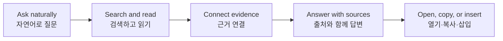

# Superpower Inside

[](https://github.com/magnitus99/Superpower-Inside/releases/latest)
[](https://obsidian.md/plugins?id=superpower-inside)
[](LICENSE)
[](LICENSE)
[](#what-makes-it-worth-trying)

> **Your vault is full of answers. Stop hunting note by note.**<br>
> **답은 이미 볼트 안에 있습니다. 이제 노트를 하나씩 뒤지는 대신, 볼트 전체에 질문하세요.**

Superpower Inside turns Obsidian into a source-grounded AI research workspace. Ask one question and let the assistant search, read, connect, and verify the relevant notes before it answers.

Superpower Inside는 Obsidian을 **출처가 보이는 AI 리서치 공간**으로 바꿉니다. 질문 하나만 던지면 관련 노트를 검색하고, 필요한 부분을 읽고, 연결 관계를 확인한 뒤 근거와 함께 답합니다.

**[Install from Obsidian Community Plugins](https://obsidian.md/plugins?id=superpower-inside)** · **[Download the latest release](https://github.com/magnitus99/Superpower-Inside/releases/latest)** · **[한국어로 읽기](#한국어)**

| Ask the vault, not the file tree | Evidence before confidence | Your model. Your tools. Your data. |
| --- | --- | --- |
| Research across eligible notes instead of guessing from one attached file.<br><sub>파일 하나가 아니라 볼트의 관련 노트를 가로질러 조사합니다.</sub> | Every serious answer can carry checked source cards, line ranges, and clear coverage limits.<br><sub>답변마다 확인한 출처, 줄 범위, 조사 한계를 함께 보여줍니다.</sub> | Use OpenAI, Claude, Ollama, Ollama Cloud, OpenRouter, or a custom OpenAI-compatible endpoint.<br><sub>원하는 모델과 로컬 도구를 선택해 그대로 연결합니다.</sub> |

> [!IMPORTANT]
> Superpower Inside is **desktop-only**, completely free, and open source. There is no premium tier or feature paywall.<br>
> Superpower Inside는 **데스크톱 전용** 완전 무료 오픈소스 플러그인입니다. 유료 등급이나 기능 잠금이 없습니다.

## One question. A complete research trail.

| You ask | Superpower Inside investigates | You get |
| --- | --- | --- |
| “Find the contradictions between my roadmap and meeting notes.”<br>“로드맵과 회의 노트 사이의 모순을 찾아줘.” | Searches hybrid evidence → verifies top ranges against current files → follows note links when needed<br>하이브리드 근거 검색 → 현재 파일의 상위 범위 검증 → 필요한 경우 노트 연결 확인 | A focused answer, a visible work log, and source cards you can open or insert back into a note<br>핵심 답변, 작업 기록, 다시 노트에 넣을 수 있는 출처 카드 |



---

## English

### Make your second brain answer for its work

Most AI chat plugins wait for you to find the right note and paste the right context. Superpower Inside can do the investigation first.

- Ask broad questions without manually assembling a prompt packet.
- See the answer, the work log, and the sources as separate, focused views.
- Open a cited note, copy its Obsidian link, or insert the evidence into your active note.
- Regenerate, save as a note, or branch a useful answer into a new research direction.
- Stop the entire run at any time—streaming, vault research, and connected tools included.

The result is not “chat beside your notes.” It is a research loop that lives inside your knowledge base.

### What makes it worth trying

| Capability | What you feel as a user |
| --- | --- |
| **Whole-vault research** | Ask for themes, changes, conflicts, or summaries across eligible files. The agent screens locally, reads in bounded batches, and states what it did or did not cover. |
| **Sources you can inspect** | Answers can include checked source cards with file paths, line ranges, relevance signals, and one-click actions to open, copy, or insert the evidence. |
| **A calmer response canvas** | Final answer, work log, and sources stay organized instead of becoming one endless tool transcript. Errors show the next useful action rather than a wall of diagnostics. |
| **Search that verifies what it finds** | BM25 works even before embeddings are configured. When vector, structural, or graph retrieval finds a passage, the tool checks the matching range against the current vault file before the model relies on it. |
| **GraphRAG for relationship questions** | Local graph evidence helps with entities, relationships, recurring themes, and connections spread across Markdown notes. |
| **Built-in private embeddings** | Ternlight runs on-device with no API key, Ollama server, or per-request network call. It is the default embedding option for new installs. |
| **Bring your own models and tools** | Use OpenAI, Claude, Ollama, Ollama Cloud, OpenRouter, or a custom OpenAI-compatible endpoint. Mention a trusted MCP stdio server with `@server` when the task needs an external tool. |
| **Model-neutral research tools** | Models with native function calling use focused search, related-evidence, read, link, list, and stats tools directly. Other models can use the same bounded read-only workflow through a compatibility protocol. |
| **Quiet background maintenance** | Indexes reuse compatible local data, resume interrupted work, and adapt indexing pressure to Obsidian responsiveness. Recovery tools stay out of the way until they are actually needed. |

### Try these as your first questions

```text
Summarize the major themes across this vault and cite the strongest evidence.

What decisions changed between my planning notes and the final meeting notes?

Find claims I keep repeating but have never supported with evidence.

Review @[Projects/Launch] and tell me what is blocked, by whom, and why.
```

### Precise context when you want it

| Mention | Meaning |
| --- | --- |
| `@note.md` | Attach a specific note by path or name. |
| `@[folder/path]` | Investigate Markdown notes in a specific folder. |
| `@server` | Use a trusted MCP stdio server for this request. |

You do not need to mention a file for every question. Built-in retrieval and native vault tools can find relevant evidence automatically; mentions are there when you want exact control.

### From install to first answer

1. Install and enable **Superpower Inside** from Obsidian Community Plugins.
2. Choose a chat model and add its local or remote provider details.
3. Open the chat sidebar and ask a real question about your vault.

Keyword retrieval and the read-only native vault tools work without an embedding provider. Ternlight is available as the built-in local embedding option. RAG and GraphRAG show the smallest useful next action only when preparation or recovery is actually needed.

### Install

#### Community Plugin Directory

1. Open **Settings → Community plugins** in Obsidian.
2. Search for **Superpower Inside**.
3. Install, enable, and connect your preferred model.

#### Manual install

1. Download the [latest GitHub Release](https://github.com/magnitus99/Superpower-Inside/releases/latest).
2. Copy `manifest.json`, `main.js`, `styles.css`, and `tern_engine_bg.wasm` into `.obsidian/plugins/superpower-inside/`.
3. Reload community plugins and enable **Superpower Inside**.

<details>
<summary><strong>Security, privacy, and honest boundaries</strong></summary>

- Settings and API keys are stored in this device's Obsidian local plugin storage and are not newly written to the synced plugin `data.json`.
- Chat messages, selected notes, retrieved chunks, tool arguments, and tool results may be sent to the LLM, embedding provider, or MCP server you configure.
- Whole-vault research inventories and screens eligible files locally. Only bounded evidence from locally selected files is sent to the configured chat provider, and coverage or transfer limits are stated in the answer.
- The built-in `superpower_inside_*` vault tools are read-only. They can search hybrid indexes, verify retrieved ranges against current files, find related indexed evidence, read bounded line ranges, list eligible text and code files, inspect resolved Markdown links, and report vault statistics. They cannot create, modify, move, or delete files.
- RAG indexes eligible text and code files in the shared file scope. GraphRAG extracts connected evidence only from eligible `.md` notes in that scope.
- Vector and graph indexes are stored locally in Obsidian's browser storage for this vault.
- MCP stdio launches local commands that you configure. Mentioned servers can run normal, non-destructive tools automatically; risky or unmentioned tools remain behind approval. Only add servers you trust.
- If the built-in Ternlight model file is missing, the plugin downloads the matching `tern_engine_bg.wasm` release asset once, verifies its size and SHA-256 checksum, and then reuses it offline. No note content is included in that download request.
- Desktop-only features such as local MCP stdio, Ollama, and runtime path handling mean mobile Obsidian is not supported.

</details>

---

## 한국어

### 당신의 세컨드 브레인에게, 근거까지 말하게 하세요

대부분의 AI 채팅 플러그인은 사용자가 먼저 알맞은 노트를 찾고 컨텍스트를 붙여주길 기다립니다. Superpower Inside는 **답하기 전에 직접 조사**합니다.

- 넓은 질문도 관련 자료를 일일이 모아 붙이지 않고 시작할 수 있습니다.
- 답변, 작업 기록, 출처를 분리된 화면에서 빠르게 확인할 수 있습니다.
- 인용된 노트를 열고, Obsidian 링크를 복사하고, 근거를 활성 노트에 바로 삽입할 수 있습니다.
- 좋은 답변은 재생성하거나 새 노트로 저장하고, 별도 세션으로 분기해 더 깊게 파고들 수 있습니다.
- 스트리밍, 볼트 조사, 연결 도구까지 포함한 전체 실행을 언제든 한 번에 중단할 수 있습니다.

단순히 “노트 옆에서 채팅”하는 것이 아닙니다. **내 지식 베이스 안에서 조사하고 검증하고 다시 기록하는 흐름**입니다.

### 지금 써볼 만한 이유

| 기능 | 사용자가 체감하는 변화 |
| --- | --- |
| **볼트 전체 리서치** | 파일 전체의 주제, 변화, 충돌, 요약을 질문하세요. 대상은 로컬에서 선별하고 제한된 배치로 읽으며, 확인한 범위와 확인하지 못한 범위를 답변에 밝힙니다. |
| **직접 확인할 수 있는 출처** | 파일 경로, 줄 범위, 일치 근거가 담긴 출처 카드를 보여줍니다. 근거 노트 열기, 링크 복사, 활성 노트 삽입까지 한 번에 이어집니다. |
| **정돈된 응답 화면** | 최종 답변, 작업 기록, 출처가 하나의 긴 도구 로그에 뒤섞이지 않습니다. 오류가 나도 진단문을 쏟아내기보다 다음 행동을 먼저 보여줍니다. |
| **찾은 근거를 현재 원문으로 검증하는 검색** | 임베딩 provider를 연결하기 전에도 BM25가 작동합니다. 벡터·구조·그래프 검색이 구간을 찾으면, 모델이 사용하기 전에 현재 볼트 파일의 같은 범위를 다시 확인합니다. |
| **관계를 읽는 GraphRAG** | Markdown 노트 곳곳에 흩어진 인물, 개념, 관계, 반복 주제를 로컬 그래프 근거로 연결합니다. |
| **내장 비공개 임베딩** | Ternlight가 API 키, Ollama 서버, 호출별 네트워크 요청 없이 기기 안에서 실행됩니다. 신규 설치의 기본 임베딩 선택지입니다. |
| **원하는 모델과 도구** | OpenAI, Claude, Ollama, Ollama Cloud, OpenRouter, 커스텀 OpenAI-compatible endpoint를 사용할 수 있습니다. 외부 도구가 필요할 때는 신뢰한 MCP stdio 서버를 `@server`로 멘션하세요. |
| **모델에 덜 의존하는 조사 도구** | 네이티브 function calling을 지원하면 검색, 관련 근거, 범위 읽기, 링크, 목록, 통계 도구를 직접 사용합니다. 그렇지 않은 모델도 호환 프로토콜을 통해 같은 제한된 읽기 전용 조사 흐름을 수행합니다. |
| **신경 쓰지 않아도 되는 유지관리** | 호환되는 로컬 인덱스를 재사용하고, 중단된 작업을 이어가며, Obsidian 반응성에 맞춰 인덱싱 압력을 자동 조절합니다. 복구 도구는 정말 필요할 때만 드러납니다. |

### 설치 후 가장 먼저 던져볼 질문

```text
이 볼트의 핵심 주제를 정리하고, 가장 강한 근거마다 출처를 달아줘.

기획 노트와 최종 회의록 사이에서 바뀐 의사결정을 찾아줘.

내가 반복해서 주장하지만 아직 근거를 남기지 않은 내용을 찾아줘.

@[Projects/Launch]를 검토하고 무엇이, 누구 때문에, 왜 막혀 있는지 정리해줘.
```

### 정확한 범위를 지정하고 싶을 때

| 멘션 | 의미 |
| --- | --- |
| `@note.md` | 경로나 이름으로 특정 노트를 첨부합니다. |
| `@[folder/path]` | 특정 폴더의 Markdown 노트를 조사합니다. |
| `@server` | 이 요청에서 신뢰한 MCP stdio 서버를 사용합니다. |

질문마다 파일을 직접 멘션할 필요는 없습니다. 기본 검색과 네이티브 볼트 도구가 관련 근거를 자동으로 찾고, 멘션은 범위를 정확히 고정하고 싶을 때 사용합니다.

### 설치에서 첫 답변까지

1. Obsidian 커뮤니티 플러그인에서 **Superpower Inside**를 설치하고 활성화합니다.
2. 사용할 채팅 모델을 고르고 로컬 또는 원격 provider 정보를 연결합니다.
3. 사이드바를 열고 실제 볼트에 대해 궁금했던 질문을 던집니다.

키워드 검색과 읽기 전용 네이티브 볼트 도구는 임베딩 provider 없이도 작동합니다. 내장 로컬 임베딩으로 Ternlight를 바로 선택할 수 있습니다. RAG와 GraphRAG는 준비나 복구가 필요한 순간에만 가장 작은 다음 행동을 보여줍니다.

### 설치

#### 커뮤니티 플러그인

1. Obsidian에서 **설정 → 커뮤니티 플러그인**을 엽니다.
2. **Superpower Inside**를 검색합니다.
3. 설치하고 활성화한 뒤 원하는 모델을 연결합니다.

#### 수동 설치

1. [최신 GitHub Release](https://github.com/magnitus99/Superpower-Inside/releases/latest)를 내려받습니다.
2. `manifest.json`, `main.js`, `styles.css`, `tern_engine_bg.wasm`을 `.obsidian/plugins/superpower-inside/`에 복사합니다.
3. 커뮤니티 플러그인을 다시 불러온 뒤 **Superpower Inside**를 활성화합니다.

<details>
<summary><strong>보안, 개인정보, 솔직한 작동 범위</strong></summary>

- 설정과 API 키는 이 기기의 Obsidian 로컬 플러그인 저장소에 보관하며, 동기화되는 플러그인 `data.json`에는 새로 기록하지 않습니다.
- 채팅 메시지, 선택한 노트, 검색된 청크, 도구 인자와 결과는 사용자가 설정한 LLM, 임베딩 provider, MCP 서버로 전송될 수 있습니다.
- 볼트 전체 리서치는 대상 파일 목록과 선별을 로컬에서 수행합니다. 로컬에서 고른 파일의 제한된 근거만 설정한 채팅 provider로 전송하며, 확인 범위나 전송 한계는 답변에 표시합니다.
- 내장 `superpower_inside_*` 볼트 도구는 읽기 전용입니다. 하이브리드 인덱스 검색, 현재 파일에 대한 검색 구간 검증, 관련 인덱스 근거 탐색, 제한된 줄 범위 읽기, 대상 텍스트·코드 파일 목록, 확인된 Markdown 링크, 볼트 통계를 제공하지만 파일을 생성·수정·이동·삭제할 수 없습니다.
- RAG는 공통 파일 범위의 대상 텍스트·코드 파일을 인덱싱하고, GraphRAG는 그 범위의 `.md` 노트에서만 연결 근거를 추출합니다.
- 벡터와 그래프 인덱스는 해당 볼트의 Obsidian 브라우저 저장소에 로컬로 보관됩니다.
- MCP stdio는 사용자가 설정한 로컬 명령을 실행합니다. 멘션한 서버의 일반적인 비파괴 도구는 자동 실행될 수 있고, 위험하거나 멘션하지 않은 도구는 승인 뒤에 실행됩니다. 신뢰하는 서버만 추가하세요.
- 내장 Ternlight 모델 파일이 없으면 같은 버전의 `tern_engine_bg.wasm` 릴리즈 자산을 한 번 내려받아 크기와 SHA-256을 검증하고 오프라인으로 재사용합니다. 이 다운로드 요청에는 노트 내용이 포함되지 않습니다.
- 로컬 MCP stdio, Ollama, 런타임 경로 처리 같은 데스크톱 기능을 사용하므로 모바일 Obsidian은 지원하지 않습니다.

</details>

---

## Development

| Document | Purpose |
| --- | --- |
| [Developer guide](docs/README_FOR_DEV.md) | Architecture, product gate, and change workflow |
| [Development setup](docs/DEV_SETUP.md) | Test vault, hot reload, and Obsidian debug setup |
| [Third-party notices](THIRD_PARTY_NOTICES.md) | Bundled dependency and license notices |

## License

[MIT](LICENSE)
