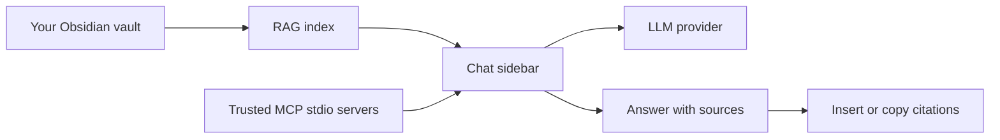

# Superpower Inside


> **Desktop AI copilot for Obsidian.** Chat with LLMs, search your vault with RAG, call trusted MCP tools, and keep source-aware answers close to your notes.

Superpower Inside is built for people who use Obsidian as a working knowledge base, not just a folder of notes.

| What it helps with | How it works |
| --- | --- |
| 🔎 Find answers in your vault | Index Markdown notes and attach relevant context to chat |
| 📌 Work with sources | Show source cards and insert citations back into notes |
| 🧠 Use your preferred model | OpenAI, Claude, Ollama, OpenRouter, or custom OpenAI-compatible providers |
| 🔌 Extend the assistant | Connect trusted local MCP stdio servers |

> [!IMPORTANT]
> Superpower Inside is **desktop-only**. It depends on desktop Obsidian features such as MCP stdio servers, local Ollama support, and local runtime path handling. Mobile Obsidian is not supported.

## 🧭 Quick Look



## ✨ Features

| Feature | Description |
| --- | --- |
| 💬 Chat sidebar | Ask questions without leaving Obsidian. |
| 🔎 Vault RAG | Search indexed Markdown notes and send relevant chunks as context. |
| 📎 File and folder mentions | Attach specific notes or folders with `@file.md` or `@[folder/path]`. |
| 🔌 MCP mentions | Use `@server` to let the assistant work with a trusted MCP server. |
| 📌 Source cards | Open sources, copy Obsidian links, and insert citations into the active note. |
| 🗂️ Chat history | Save and reopen chat sessions inside your vault. |
| 🧠 Provider choice | Use OpenAI, Claude, Ollama, Ollama Cloud, OpenRouter, or a custom OpenAI-compatible endpoint. |

## 🚀 Install

### Community Plugin Directory

1. Open **Settings -> Community plugins** in Obsidian.
2. Search for **Superpower Inside**.
3. Install and enable the plugin.
4. Open the plugin settings and configure a provider.

### Manual Install

1. Download the latest release from [GitHub Releases](https://github.com/magnitus99/Superpower-Inside/releases).
2. Copy `manifest.json`, `main.js`, and `styles.css` into `.obsidian/plugins/superpower-inside/`.
3. Reload community plugins in Obsidian.
4. Enable **Superpower Inside**.

## ✅ First Setup

| Step | What to do | Where |
| --- | --- | --- |
| 1 | Choose and enable your LLM provider | Settings -> Superpower Inside -> Providers |
| 2 | Add the provider API key or local base URL | Settings -> Providers |
| 3 | Choose the default chat model | Settings -> Chat |
| 4 | Choose an embedding provider and model | Settings -> RAG |
| 5 | Run the first vault index | Command Palette -> `Reindex Vault for RAG` |
| 6 | Open the chat sidebar | Ribbon chat icon or Command Palette -> `Open AI Chat` |

## 💡 Everyday Use

### 💬 Chat With Your Vault

Ask natural questions in the sidebar. When RAG is enabled, Superpower Inside searches your indexed Markdown notes and attaches relevant context before the model answers.

Examples:

```text
Summarize my notes about active projects.
What did I write about retrieval-augmented generation last month?
Find contradictions between my planning notes and meeting notes.
```

### 📎 Attach Exact Context

Use mentions when you want the assistant to look at a specific source.

| Mention | Meaning |
| --- | --- |
| `@note.md` | Attach a note by path or name. |
| `@[folder/path]` | Attach Markdown notes from a folder. |
| `@server` | Attach and use a trusted MCP server. |

### 📌 Work With Sources

Source cards help you check where an answer came from. You can open the source note, copy an Obsidian link, or insert a citation into the active note.

### 🗂️ Save Chat Sessions

Chats can be saved as Markdown files in your configured chat folder. This keeps research trails, source metadata, and useful answers inside the vault.

<details>
<summary><strong>Security and data access</strong></summary>

- API keys are stored in the plugin `data.json` file in plain text by the host app. Do not share or sync that file to untrusted locations.
- Chat messages, selected notes, retrieved RAG chunks, tool arguments, and tool results may be sent to the configured LLM, embedding provider, or MCP server.
- RAG features enumerate Markdown files in the vault to build and refresh the index.
- Citation actions and copy buttons write text to the system clipboard.
- MCP stdio launches local commands that you configure. Only add MCP servers you trust.
- When you mention an MCP server with `@server`, Superpower Inside treats that mention as intent to use the trusted server and may auto-run non-destructive model-requested tools from it. Tool arguments and results may be sent back to the configured LLM provider to generate the final answer.
- Local Ollama and local MCP servers can run on your machine, but provider settings may still send data over the network.

</details>

## 📚 Documentation

| Document | Purpose |
| --- | --- |
| [Developer guide](docs/README_FOR_DEV.md) | Architecture map and feature-change guide |
| [Development setup](docs/DEV_SETUP.md) | Local test vault, hot reload, and debugging setup |
| [Community submission guide](docs/OBSIDIAN_COMMUNITY_SUBMISSION.md) | Release and Obsidian community plugin checklist |

## 한국어 안내

> **Obsidian 데스크톱용 AI 코파일럿.** LLM 채팅, 볼트 RAG 검색, 신뢰한 MCP 도구 호출, 출처 기반 답변을 노트 작업 흐름 안에서 제공합니다.

Superpower Inside는 Obsidian을 실제 지식 작업 공간으로 쓰는 사람을 위한 플러그인입니다. 질문하고, 노트를 찾아보고, 출처를 확인하고, 필요한 인용을 다시 노트에 넣는 흐름을 한 화면에서 처리할 수 있게 돕습니다.

| 도움이 되는 일 | 작동 방식 |
| --- | --- |
| 🔎 볼트에서 답 찾기 | Markdown 노트를 인덱싱하고 관련 컨텍스트를 채팅에 첨부 |
| 📌 출처 확인하기 | 답변 아래 출처 카드를 표시하고 노트로 다시 삽입 |
| 🧠 원하는 모델 쓰기 | OpenAI, Claude, Ollama, OpenRouter, 커스텀 OpenAI-compatible provider 지원 |
| 🔌 도구 확장하기 | 신뢰한 로컬 MCP stdio 서버 연결 |

> [!IMPORTANT]
> Superpower Inside는 **데스크톱 전용**입니다. MCP stdio 서버, 로컬 Ollama, 데스크톱 런타임 경로 처리를 사용하므로 모바일 Obsidian은 지원하지 않습니다.

## ✨ 주요 기능

| 기능 | 설명 |
| --- | --- |
| 💬 사이드바 채팅 | Obsidian을 떠나지 않고 AI와 대화합니다. |
| 🔎 볼트 RAG | Markdown 노트를 검색해 관련 청크를 모델 컨텍스트로 보냅니다. |
| 📎 파일/폴더 멘션 | `@file.md`, `@[folder/path]`로 특정 노트나 폴더를 붙입니다. |
| 🔌 MCP 멘션 | `@server`로 신뢰한 MCP 서버를 사용합니다. |
| 📌 출처 카드 | 출처 열기, Obsidian 링크 복사, 활성 노트에 인용 삽입을 지원합니다. |
| 🗂️ 채팅 저장 | 채팅 세션을 볼트 안의 Markdown 파일로 저장하고 다시 열 수 있습니다. |
| 🧠 Provider 선택 | OpenAI, Claude, Ollama, Ollama Cloud, OpenRouter, 커스텀 OpenAI-compatible endpoint를 지원합니다. |

## 🚀 설치

### 커뮤니티 플러그인

1. Obsidian에서 **설정 -> 커뮤니티 플러그인**을 엽니다.
2. **Superpower Inside**를 검색합니다.
3. 설치하고 활성화합니다.
4. 플러그인 설정에서 사용할 provider를 설정합니다.

### 수동 설치

1. [GitHub Releases](https://github.com/magnitus99/Superpower-Inside/releases)에서 최신 릴리스를 받습니다.
2. `manifest.json`, `main.js`, `styles.css`를 `.obsidian/plugins/superpower-inside/`에 복사합니다.
3. Obsidian 커뮤니티 플러그인을 다시 로드합니다.
4. **Superpower Inside**를 활성화합니다.

## ✅ 첫 설정

| 순서 | 할 일 | 위치 |
| --- | --- | --- |
| 1 | LLM provider 선택 및 활성화 | Settings -> Superpower Inside -> Providers |
| 2 | API Key 또는 로컬 Base URL 입력 | Settings -> Providers |
| 3 | 기본 채팅 모델 선택 | Settings -> Chat |
| 4 | 임베딩 provider와 모델 선택 | Settings -> RAG |
| 5 | 첫 볼트 인덱싱 실행 | Command Palette -> `Reindex Vault for RAG` |
| 6 | 채팅 사이드바 열기 | 리본 채팅 아이콘 또는 Command Palette -> `Open AI Chat` |

## 💡 사용법

### 💬 볼트와 대화하기

사이드바에서 자연어로 질문하세요. RAG가 켜져 있으면 Superpower Inside가 인덱싱된 Markdown 노트에서 관련 내용을 찾아 모델 요청에 함께 보냅니다.

예시:

```text
진행 중인 프로젝트 노트를 요약해줘.
지난달에 RAG에 대해 적은 내용을 찾아줘.
기획 노트와 회의 노트 사이의 모순을 찾아줘.
```

### 📎 정확한 컨텍스트 붙이기

특정 자료를 보게 하고 싶을 때 멘션을 사용합니다.

| 멘션 | 의미 |
| --- | --- |
| `@note.md` | 노트 경로나 이름으로 노트를 첨부합니다. |
| `@[folder/path]` | 폴더 안의 Markdown 노트를 첨부합니다. |
| `@server` | 신뢰한 MCP 서버를 첨부하고 사용합니다. |

### 📌 출처와 함께 작업하기

출처 카드는 답변이 어디에서 왔는지 확인하게 해줍니다. 출처 노트를 열거나, Obsidian 링크를 복사하거나, 활성 노트에 인용을 삽입할 수 있습니다.

### 🗂️ 채팅 세션 저장하기

채팅은 설정한 저장 폴더에 Markdown 파일로 저장할 수 있습니다. 조사 흐름, 출처 메타데이터, 유용한 답변을 볼트 안에 남길 수 있습니다.

<details>
<summary><strong>보안과 데이터 접근</strong></summary>

- API 키는 호스트 앱의 플러그인 `data.json` 파일에 평문으로 저장됩니다. 신뢰하지 않는 위치로 공유하거나 동기화하지 마세요.
- 채팅 메시지, 선택된 노트, RAG 청크, 도구 호출 인자와 결과는 설정한 LLM, 임베딩 provider, MCP 서버로 전송될 수 있습니다.
- RAG 기능은 인덱스 생성과 갱신을 위해 볼트의 Markdown 파일 목록을 열람합니다.
- 출처 복사와 메시지 복사 기능은 시스템 클립보드에 텍스트를 씁니다.
- MCP stdio는 사용자가 설정한 로컬 명령을 실행합니다. 신뢰하는 MCP 서버만 추가하세요.
- `@server`로 MCP 서버를 멘션하면 Superpower Inside는 해당 멘션을 신뢰한 서버를 사용하겠다는 의사로 보고, 모델이 요청한 non-destructive 툴을 자동 실행할 수 있습니다. 툴 인자와 결과는 최종 답변 생성을 위해 설정한 LLM provider로 다시 전달될 수 있습니다.
- 로컬 Ollama와 로컬 MCP 서버는 사용자의 기기에서 실행될 수 있지만, provider 설정에 따라 데이터가 네트워크로 전송될 수 있습니다.

</details>

## Development

Development documentation lives in:

- [Developer guide](docs/README_FOR_DEV.md)
- [Development setup](docs/DEV_SETUP.md)
- [Community submission guide](docs/OBSIDIAN_COMMUNITY_SUBMISSION.md)

## License

MIT
