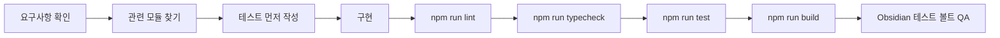
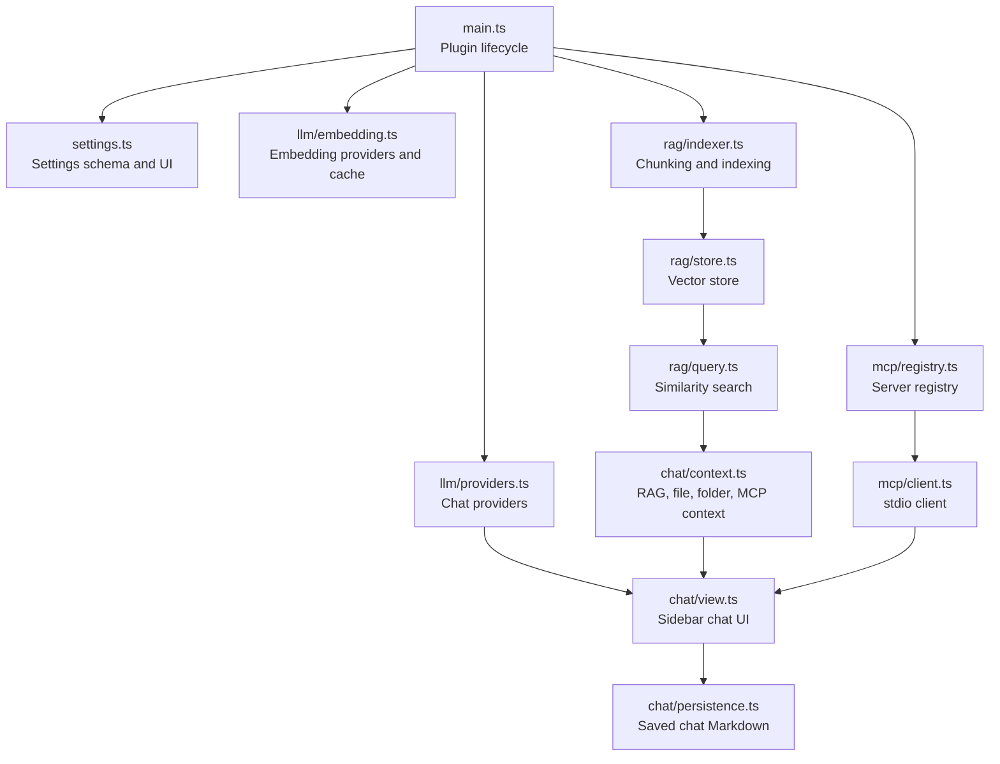

# 개발자 가이드 - Superpower Inside

> 이 문서는 Superpower Inside에 기능을 추가하거나 버그를 수정하려는 개발자를 위한 가이드입니다. 로컬 환경 구축만 필요하면 [DEV_SETUP.md](DEV_SETUP.md)를 먼저 보세요.

## 한눈에 보는 작업 흐름



## 개발 원칙

| 원칙 | 기준 |
| --- | --- |
| TypeScript strict | `as any`, `@ts-ignore`, `eslint-disable` 없이 타입을 맞춥니다. |
| 테스트 우선 | 순수 로직은 Vitest 테스트를 먼저 추가합니다. |
| Obsidian API 우선 | 런타임 파일 접근은 `app.vault`, `vault.adapter`, `cachedRead`, `modify`, `create`를 우선합니다. |
| UI는 DOM API | 사용자/모델 출력에 `innerHTML`을 직접 넣지 않습니다. |
| 작은 변경 | 큰 기능은 `ChatView`에 계속 누적하지 말고 helper나 전용 모듈로 분리합니다. |
| fish 명령어 | 문서와 스크립트 예시는 fish 문법으로 작성합니다. |

## 아키텍처 개요



| 영역 | 핵심 파일 | 역할 |
| --- | --- | --- |
| 플러그인 생명주기 | `main.ts` | 설정 로드, 명령 등록, provider/RAG/MCP 초기화 |
| 설정 | `src/settings.ts` | 설정 타입, 기본값, 설정 탭 UI, 연결 검증 진입점 |
| LLM | `src/llm/providers.ts` | OpenAI-compatible, Claude, Ollama, OpenRouter 채팅/스트리밍 |
| 임베딩 | `src/llm/embedding.ts` | OpenAI-compatible/Ollama 임베딩, Dexie 캐시 |
| RAG | `src/rag/indexer.ts`, `src/rag/store.ts`, `src/rag/query.ts` | 청킹, 벡터 저장, 유사도 검색 |
| 채팅 | `src/chat/view.ts`, `src/chat/context.ts`, `src/chat/persistence.ts` | UI, 컨텍스트 구성, 세션 저장/로드 |
| MCP | `src/mcp/client.ts`, `src/mcp/registry.ts` | stdio MCP 연결, 도구 목록, 호출 상태 관리 |
| 호환 유틸 | `src/utils/obsidian-compat.ts`, `src/utils/mcp-json.ts` | 비공식 API 접근 격리, MCP JSON 검증 |

## 빠른 개발 시작

```fish
# 1회성 준비
./scripts/setup-dev.fish

# 터미널 1: esbuild watch
npm run dev

# 터미널 2: Obsidian 디버그 모드로 테스트 볼트 열기
./scripts/launch-obsidian-debug.fish
```

검증은 다음 순서를 기본으로 합니다.

```fish
npm run lint
npm run typecheck
npm run test
npm run build
```

## 주요 기능을 수정하는 방법

### Provider 추가 또는 수정

수정 전 확인할 파일:

| 파일 | 확인할 내용 |
| --- | --- |
| `src/llm/providers.ts` | `LLMProvider` 구현, 스트리밍 delta, tool call 변환 |
| `src/llm/validation.ts` | 연결 테스트와 모델 목록 검증 |
| `src/settings.ts` | provider 타입, 기본 설정, 설정 UI |
| `main.ts` | `createProvider()` 호출과 기본 모델 해석 |
| `src/llm/providers.test.ts` | provider별 메시지 변환과 tool call 테스트 |

추가 절차:

1. `ProviderKey`, label, 기본 설정을 추가합니다.
2. provider 구현은 `LLMProvider` 인터페이스를 만족하게 작성합니다.
3. OpenAI-compatible 계열이면 기존 `OpenAICompatibleProvider` 재사용을 먼저 검토합니다.
4. 설정 탭에서 API Key, Base URL, model 목록이 일관되게 보이도록 연결합니다.
5. 스트리밍, 일반 응답, tool call 메시지 변환 테스트를 추가합니다.

### RAG와 임베딩 수정

수정 전 확인할 파일:

| 파일 | 확인할 내용 |
| --- | --- |
| `src/rag/indexer.ts` | `chunkMarkdown()`, 파일별 인덱싱, metadata 생성 |
| `src/rag/status.ts` | missing/stale/unknown 상태 판정 |
| `src/rag/store.ts` | `JsonFileVectorStore`, 벡터 entry 구조 |
| `src/rag/query.ts` | query embedding, cosine similarity, topK |
| `src/chat/context.ts` | 자동 RAG 결과가 채팅 컨텍스트와 citation으로 들어가는 방식 |

주의할 점:

- 단순 `\n\n` 기준 청킹으로 되돌리지 않습니다. 헤딩과 코드블록 경계를 유지해야 합니다.
- 임베딩 provider나 모델이 바뀌면 stale 판정과 재인덱싱 흐름을 함께 확인합니다.
- `.test-vault/.superpower-inside/vectors.json`은 실제 런타임 산출물입니다. 일반 코드 변경 diff에 포함하지 않습니다.
- 채팅 저장 폴더는 RAG 제외 대상에 자동으로 포함됩니다.

### Chat UI 수정

`src/chat/view.ts`는 큰 파일입니다. 새 기능을 넣을 때는 먼저 분리 가능한지 확인하세요.

| 변경 유형 | 권장 위치 |
| --- | --- |
| 컨텍스트 조립 | `src/chat/context.ts` |
| 저장/로드 포맷 | `src/chat/persistence.ts` |
| 멘션 파싱 | `src/chat/mention-parser.ts` |
| 출처 정규화 | `src/chat/source-validation.ts` |
| 프롬프트 템플릿 | `src/chat/prompt-library.ts` |
| 실제 DOM 조립 | `src/chat/view.ts` |

UI 규칙:

- Obsidian의 `createEl`, `createDiv`, `createSpan` 계열을 우선 사용합니다.
- 모델 출력이나 사용자 입력을 `innerHTML`로 직접 렌더링하지 않습니다.
- 긴 텍스트, 빈 상태, 스트리밍 중단, provider 미설정 상태를 함께 확인합니다.
- CSS 클래스는 `superpower-inside-` 프리픽스를 유지합니다.

### MCP 도구 연결과 자동 실행 정책

핵심 파일:

| 파일 | 역할 |
| --- | --- |
| `src/mcp/client.ts` | MCP SDK client와 stdio transport 생성 |
| `src/mcp/registry.ts` | 서버 설정, 연결 상태, tool 목록 관리 |
| `src/utils/mcp-json.ts` | 표준 `mcpServers` JSON import/validation |
| `src/chat/context.ts` | `@server` 멘션을 MCP 컨텍스트로 변환 |
| `src/chat/view.ts` | 모델이 요청한 tool call 실행과 결과 표시 |

정책:

- 이 플러그인은 `manifest.json`의 `isDesktopOnly: true`를 전제로 합니다.
- MCP stdio는 사용자가 설정한 로컬 명령을 실행합니다. 설정 UI와 README에서는 신뢰한 서버만 추가하라고 안내해야 합니다.
- `@server` 멘션은 해당 MCP 서버를 사용하겠다는 사용자 의사로 처리됩니다.
- 현재 기본 정책은 멘션된 신뢰 서버의 non-destructive 모델 요청 도구를 자동 실행할 수 있습니다.
- tool arguments와 tool results는 최종 답변 생성을 위해 LLM provider로 다시 전달될 수 있습니다.

### 채팅 저장 포맷 수정

확인할 파일:

| 파일 | 확인할 내용 |
| --- | --- |
| `src/chat/persistence.ts` | Markdown 직렬화, HTML comment payload, legacy load |
| `src/chat/persistence.test.ts` | 이전 포맷과 최신 포맷 호환성 |
| `.test-vault/SuperpowerInsideChats/` | 실제 저장 세션 샘플 |

수정 기준:

- 2026-05-10 계열 legacy 세션과 2026-05-14 계열 최신 메타 세션을 모두 열 수 있어야 합니다.
- 새 메타데이터를 추가하면 누락된 값에 대한 기본값을 명확히 둡니다.
- 저장된 Markdown은 사람이 읽을 수 있어야 하며, machine-readable payload는 호환성을 깨지 않게 다룹니다.

## 테스트 작성 기준

| 변경 | 필요한 테스트 |
| --- | --- |
| 순수 함수 | 해당 함수 전용 Vitest 테스트 |
| provider message 변환 | request body, stream delta, tool call round-trip 테스트 |
| RAG 청킹/상태 | heading, code block, stale/missing/unknown 케이스 |
| mention parsing | 공백 경로, 중복 제거, 서버 멘션 테스트 |
| persistence | legacy load, latest load, round-trip 저장 테스트 |
| Obsidian 런타임 UI | Vitest가 어려우면 `.test-vault` 수동 QA 절차를 PR/커밋 메모에 남김 |

테스트 실행:

```fish
npm run test
```

특정 테스트 파일만 볼 때:

```fish
npx vitest run src/chat/mention-parser.test.ts
```

## 로컬 QA 체크리스트

- [ ] `npm run lint`
- [ ] `npm run typecheck`
- [ ] `npm run test`
- [ ] `npm run build`
- [ ] Obsidian에서 플러그인이 로드됨
- [ ] 설정 탭이 열림
- [ ] 기본 채팅 모델이 선택됨
- [ ] RAG 상태가 설정 탭에 표시됨
- [ ] `Reindex Vault for RAG` 명령이 동작함
- [ ] `Open AI Chat` 명령으로 사이드바가 열림
- [ ] 변경한 기능의 실패/빈 상태가 확인됨

## DevTools 스니펫

```javascript
// 현재 활성 플러그인 목록
Object.keys(app.plugins.plugins);

// Superpower Inside 설정 확인
app.plugins.plugins['superpower-inside'].settings;

// 채팅 뷰 열기
app.workspace.getRightLeaf(false).setViewState({ type: 'superpower-inside-chat' });

// 현재 볼트의 Markdown 파일 수
app.vault.getMarkdownFiles().length;

// RAG 전체 재인덱싱
const plugin = app.plugins.plugins['superpower-inside'];
await plugin.vaultIndexer?.reindexAll();

// 임베딩 캐시 초기화
await Dexie.delete('SuperpowerInsideEmbeddingCache');
```

## 릴리스 기준

릴리스 전에는 다음 파일의 버전을 함께 맞춥니다.

| 파일 | 기준 |
| --- | --- |
| `manifest.json` | Obsidian이 읽는 플러그인 버전 |
| `package.json` | npm package version |
| `versions.json` | 플러그인 버전별 최소 Obsidian 버전 |

태그 이름은 `manifest.json.version`과 완전히 같아야 합니다. 예를 들어 버전이 `1.0.0`이면 GitHub Release 태그도 `1.0.0`이어야 하며, `v1.0.0`만 만들면 Obsidian 커뮤니티 제출 화면에서 릴리스를 찾지 못할 수 있습니다.

릴리스 준비:

```fish
./scripts/bump-version.fish patch
```

수동 검증 순서:

```fish
npm ci
npm run lint
npm run typecheck
npm run test
npm run build
```

## 관련 문서

| 문서 | 내용 |
| --- | --- |
| [DEV_SETUP.md](DEV_SETUP.md) | 테스트 볼트, 심링크, hot-reload, 디버깅 환경 |
| [OBSIDIAN_COMMUNITY_SUBMISSION.md](OBSIDIAN_COMMUNITY_SUBMISSION.md) | Obsidian 커뮤니티 플러그인 제출 체크리스트 |
| [../README.md](../README.md) | 사용자용 소개, 설치, 첫 설정, 보안 안내 |
