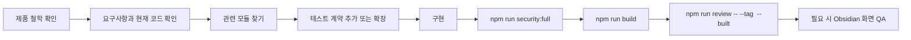
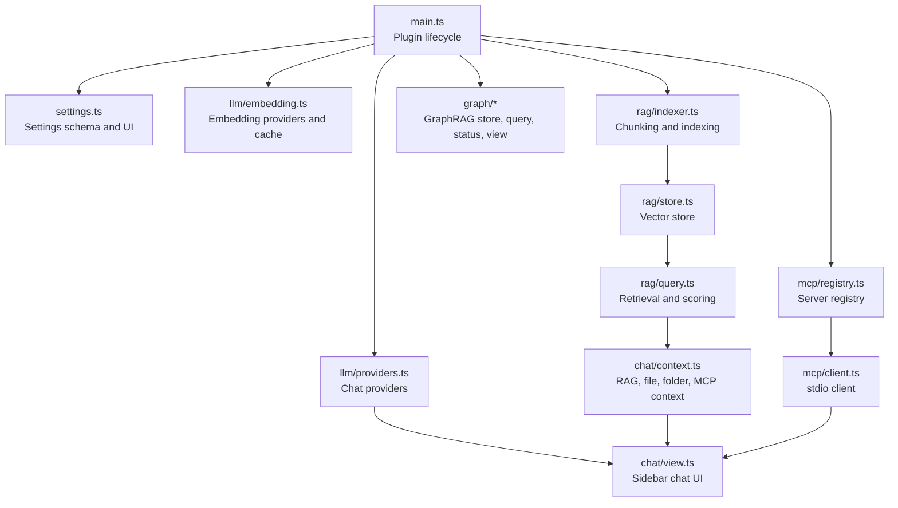

# 개발자 가이드 - Superpower Inside

> 이 문서는 Superpower Inside에 기능을 추가하거나 버그를 수정할 때 따르는 현재 개발 계약입니다. 로컬 환경 준비는 [DEV_SETUP.md](DEV_SETUP.md)를 먼저 보세요.

## 한눈에 보는 작업 흐름



## 제품 철학 Gate

기능을 추가하거나 UI를 바꾸기 전에 먼저 이 기준을 통과시킵니다. 하나라도 실패하면 구현을 시작하지 말고 UX, 범위, 자동화 방식을 먼저 바꿉니다.

| 질문 | 통과 기준 |
| --- | --- |
| 새 설정이 필요한가 | 자동 감지, 안전한 기본값, 기존 설정 재사용, 점진적 공개로 해결할 수 없을 때만 추가합니다. |
| 사용자가 계속 관리해야 하는 상태가 늘어나는가 | 자동 처리하고, 수동 조작은 복구용으로 둡니다. |
| 설정/상태 화면이 전문가용 조작판처럼 커지는가 | 사용자가 해야 할 행동이 있을 때만 한 문장 이유와 하나의 primary action을 보여줍니다. |
| 실패가 조용히 숨겨지는가 | 사용자가 행동해야 할 때만 짧고 구체적인 이유와 next action을 보여줍니다. |
| 내부 복잡도가 사용자 언어로 새는가 | Rust/WASM, index, cache, ontology 같은 내부어는 사용자가 판단해야 할 때만 노출합니다. |
| 복구 기능이 기본 workflow가 되는가 | reindex, reset, migrate, rebuild, retry는 문제 해결용으로 두고 첫 사용법이나 주요 CTA로 만들지 않습니다. |
| UI를 바꿨는가 | 가능하면 실제 화면으로 밀도, 정렬, 대비, overflow, 상태 변화를 확인합니다. 릴리즈 절차의 필수 스크린샷 게이트로 만들지는 않습니다. |

### 기능별 적용

| 영역 | 지시 |
| --- | --- |
| Provider 설정 | provider/model 선택을 늘리기 전에 기본값, 마지막 성공값, 연결 검증, 오류 next action을 먼저 설계합니다. |
| RAG/GraphRAG | 인덱스 운영 UI를 늘리지 않습니다. 자동 동기화, stale 판정, 실패 재시도, 진단 로그를 먼저 설계합니다. |
| MCP | 신뢰와 실행 의사를 명확히 하되 매번 확인을 요구하지 않습니다. 위험하거나 destructive한 동작은 별도 gate를 둡니다. |
| 채팅 UI | 사용자가 질문하고 답을 검토하는 흐름을 방해하지 않습니다. 출처, 도구 결과, 오류는 답변 흐름 안에서 간결하게 보여줍니다. |
| 진단/로그 | 일반 사용 화면이 아니라 문제 해결 표면입니다. 사용자에게 필요한 경우에만 요약해 노출하고 상세는 진단으로 보냅니다. |
| 문서 | 문서는 현재 동작과 현재 계약만 남깁니다. 완료된 계획, migration 일지, 릴리스별 변경 목록은 source of truth로 남기지 않습니다. |

### 완료 조건

- PR/완료 보고에는 제품 철학 관점에서 무엇을 자동화했고, 어떤 수동 action을 왜 남겼는지 설명할 수 있어야 합니다.
- 새 UI가 생겼다면 "사용자가 무엇을 해야 하는가"가 화면에서 3초 안에 읽혀야 합니다.
- 새 상태/오류 문구는 원인, 영향, 다음 행동 중 최소 두 가지를 포함해야 합니다.
- 설정이나 maintenance action을 추가했다면, 그것이 일상 workflow가 아니라 복구/고급 설정인 이유가 명확해야 합니다.

## 공통 작업 중심 UI 디자인 계약

RAG 설정 화면에서 시작한 계약을 General의 범용 설정 helper로 승격하고 Chat, MCP, Advanced에도 적용했습니다. 모든 설정 화면 변경은 아래 계층을 기본 계약으로 사용합니다.

| 계층 | 역할 | 구현 기준 |
| --- | --- | --- |
| Section | 하나의 사용자 목적 | 탭 배경 위의 유일한 카드 표면입니다. 제목, 짧은 설명, body를 가집니다. |
| Row | 상태, 설정 또는 작업 한 가지 | section 안에서는 배경 카드 대신 공통 padding과 구분선을 사용합니다. |
| Status | 현재 상태와 근거 | `label + state + supporting detail`로 쓰고 색상과 텍스트를 함께 사용합니다. |
| Action | 사용자가 지금 할 수 있는 일 | section당 primary action은 최대 하나며, 반복되는 disabled reason은 영역에서 한 번 설명합니다. |
| Disclosure | 고급 설정과 복구 | button, `aria-expanded`, `aria-controls`, Obsidian icon을 사용합니다. |

구현 순서는 다음과 같습니다.

1. 현재 상태와 사용자의 가장 작은 다음 행동을 먼저 정합니다.
2. 일상 설정과 진단·복구를 분리합니다.
3. 최상위 section 외의 카드 컨테이너를 제거하고 row로 평탄화합니다.
4. Obsidian theme variable에 매핑된 의미 토큰을 재사용합니다.
5. TS에서는 DOM과 host callback만 연결합니다. 검색·랭킹·상태 판정 정책을 UI 편의를 위해 복제하지 않습니다.
6. 준비, 진행 중, 빈 상태, 부분 실패, 오류, disabled 상태를 테스트와 실제 화면으로 확인합니다.

`src/settings.ts`에서는 `createSettingsSection`, `createSettingsStatusRow`, `createSettingsActionRow`, `createSettingsNotice`, `createSettingsDisclosure`를 기본으로 사용합니다. RAG 전용 helper도 이 범용 section과 disclosure에 위임하므로 새 탭별 카드·접힘 체계를 만들지 않습니다.

참조 문서:

- [General 작업 중심 설정 UI 설계](superpowers/specs/2026-07-11-general-task-centered-ui-design.md)
- [Chat 작업 중심 설정 UI 설계](superpowers/specs/2026-07-11-chat-task-centered-ui-design.md)
- [MCP 작업 중심 설정 UI 설계](superpowers/specs/2026-07-11-mcp-task-centered-ui-design.md)
- [Advanced 작업 중심 설정 UI 설계](superpowers/specs/2026-07-11-advanced-task-centered-ui-design.md)
- [RAG 작업 중심 설정 UI 설계](superpowers/specs/2026-07-11-rag-task-centered-ui-design.md)

## 개발 원칙

| 원칙 | 기준 |
| --- | --- |
| TypeScript strict | `as any`, `@ts-ignore`, `@ts-expect-error`, `eslint-disable` 없이 타입을 맞춥니다. |
| 테스트 우선 | 순수 로직은 Vitest 또는 Rust unit test를 먼저 추가하거나 기존 계약을 확장합니다. |
| Obsidian API 우선 | 런타임 파일 접근은 `app.vault`, `vault.adapter`, `cachedRead`, `modify`, `create`를 우선합니다. |
| UI는 DOM API | 사용자/모델 출력에 `innerHTML`을 직접 넣지 않습니다. |
| 작은 변경 | 큰 기능은 `ChatView`에 계속 누적하지 말고 helper나 전용 모듈로 분리합니다. |
| 플랫폼 명시 | 로컬 작업 문서는 PowerShell, fish 등 실제 실행 shell을 명시하고 한 플랫폼 전용 절차를 전체 저장소 기준처럼 쓰지 않습니다. |

## 아키텍처 개요



| 영역 | 핵심 파일 | 역할 |
| --- | --- | --- |
| 플러그인 생명주기 | `main.ts` | 설정 로드, 명령 등록, provider/RAG/MCP/GraphRAG 초기화 |
| 설정 | `src/settings.ts`, `src/settings-overview.ts` | 설정 타입, 기본값, 설정 탭 UI, 상태 요약 |
| LLM | `src/llm/providers.ts` | OpenAI-compatible, Claude, Ollama, OpenRouter 채팅/스트리밍 |
| 임베딩 | `src/llm/embedding.ts` | OpenAI-compatible/Ollama 임베딩, Dexie 캐시 |
| RAG | `src/rag/indexer.ts`, `src/rag/store.ts`, `src/rag/query.ts`, `src/rag/retrieval-pipeline.ts` | 청킹, 저장, 후보 조회, 점수화 |
| GraphRAG | `src/graph/*` | 추출, store, entity resolution, community, query, explorer |
| 채팅 | `src/chat/view.ts`, `src/chat/context.ts`, `src/chat/persistence.ts` | UI, 컨텍스트 구성, 세션 저장/로드 |
| MCP | `src/mcp/client.ts`, `src/mcp/registry.ts` | stdio MCP 연결, 도구 목록, 호출 상태 관리 |
| Rust/WASM 경계 | `crates/rag-wasm/`, `src/rag/rust-core.ts`, `generated/rag-wasm/` | 결정적 계산과 TS bridge |

## 빠른 개발 시작

Windows:

```powershell
.\scripts\setup-dev.ps1
npm run dev
.\scripts\launch-obsidian-debug.ps1
```

macOS:

```fish
./scripts/setup-dev.fish
npm run dev
./scripts/launch-obsidian-debug.fish
```

기본 검증 순서:

```powershell
npm run security:full
npm run build
npm run review -- --tag <manifest-version> --built
```

## 주요 기능을 수정하는 방법

### Provider 추가 또는 수정

수정 전 확인할 파일:

| 파일 | 확인할 내용 |
| --- | --- |
| `src/llm/providers.ts` | `LLMProvider` 구현, 스트리밍 delta, tool call 변환 |
| `src/llm/validation.ts` | 연결 테스트와 모델 목록 검증 |
| `src/settings.ts` | provider 타입, 기본 설정, 설정 UI |
| `main.ts` | `createProvider()` 호출과 기본 모델 해석 |
| `src/llm/providers.test.ts` | provider별 메시지 변환과 tool call 테스트 |

추가 기준:

1. Provider 선택이 사용자의 첫 설정 부담을 늘리지 않는지 먼저 확인합니다.
2. 새 provider가 필요하면 `ProviderKey`, label, 기본 설정을 추가합니다.
3. OpenAI-compatible 계열이면 기존 `OpenAICompatibleProvider` 재사용을 먼저 검토합니다.
4. 설정 탭에서는 연결 상태, 실패 이유, 다음 행동을 먼저 보이게 하고 내부 transport 세부값은 필요한 경우에만 노출합니다.
5. 스트리밍, 일반 응답, tool call 메시지 변환 테스트를 추가합니다.

### RAG, GraphRAG, 임베딩 수정

수정 전 확인할 파일:

| 파일 | 확인할 내용 |
| --- | --- |
| `src/rag/indexer.ts` | Markdown/file chunking과 인덱싱 흐름 |
| `src/rag/status.ts`, `src/graph/status.ts` | missing/stale/partial/schema-error 상태 판정 |
| `src/rag/query.ts`, `src/rag/retrieval-pipeline.ts` | retrieval candidate와 final context score |
| `src/graph/query-engine.ts` | GraphRAG local/global/hybrid/evidence-first query |
| `src/rag/settings-display.ts` | 설정 화면 상태와 next action 표시 |

주의할 점:

- 단순 `\n\n` 기준 청킹으로 되돌리지 않습니다. 헤딩과 코드블록 경계를 유지해야 합니다.
- 모델, provider, ontology가 바뀌면 stale 판정과 자동/수동 복구 흐름을 함께 확인합니다.
- `.test-vault/.superpower-inside/`는 실제 런타임 산출물입니다. 일반 코드 변경 diff에 포함하지 않습니다.
- 사용자가 직접 reindex/reset을 관리하게 만드는 UI보다 자동 동기화와 명확한 next action을 우선합니다.
- 인덱스 수, cache, ontology schema, vector store 같은 내부 상태를 보여줄 때는 사용자가 취할 행동과 연결합니다. 행동이 없으면 진단 로그나 explorer 안에 둡니다.

### Chat UI 수정

`src/chat/view.ts`는 큰 파일입니다. 새 기능을 넣을 때는 먼저 분리 가능한지 확인하세요.

| 변경 유형 | 권장 위치 |
| --- | --- |
| 컨텍스트 조립 | `src/chat/context.ts` |
| 저장/로드 포맷 | `src/chat/persistence.ts` |
| 멘션 파싱 | `src/chat/mention-parser.ts` |
| 출처 정규화 | `src/chat/source-validation.ts` |
| 프롬프트 템플릿 | `src/chat/prompt-library.ts` |
| 실제 DOM 조립 | `src/chat/view.ts` |

UI 규칙:

- Obsidian의 `createEl`, `createDiv`, `createSpan` 계열을 우선 사용합니다.
- 모델 출력이나 사용자 입력을 `innerHTML`로 직접 렌더링하지 않습니다.
- 긴 텍스트, 빈 상태, 스트리밍 중단, provider 미설정 상태를 함께 확인합니다.
- CSS 클래스는 `superpower-inside-` 프리픽스를 유지합니다.
- UI/DOM/CSS/레이아웃/카피/상태 표시를 바꾸면 가능하면 실제 실행 화면을 확인합니다. 릴리즈 자체는 스크린샷 확인을 요구하지 않습니다.

### MCP 도구 연결과 자동 실행 정책

핵심 파일:

| 파일 | 역할 |
| --- | --- |
| `src/mcp/client.ts` | MCP SDK client와 stdio transport 생성 |
| `src/mcp/registry.ts` | 서버 설정, 연결 상태, tool 목록 관리 |
| `src/utils/mcp-json.ts` | 표준 `mcpServers` JSON import/validation |
| `src/chat/context.ts` | `@server` 멘션을 MCP 컨텍스트로 변환 |
| `src/chat/view.ts` | 모델이 요청한 tool call 실행과 결과 표시 |

정책:

- 이 플러그인은 `manifest.json`의 `isDesktopOnly: true`를 전제로 합니다.
- MCP stdio는 사용자가 설정한 로컬 명령을 실행합니다. 설정 UI와 README에서는 신뢰한 서버만 추가하라고 안내해야 합니다.
- `@server` 멘션은 해당 MCP 서버를 사용하겠다는 사용자 의사로 처리됩니다.
- 현재 기본 정책은 멘션된 신뢰 서버의 non-destructive 모델 요청 도구를 자동 실행할 수 있습니다.
- tool arguments와 tool results는 최종 답변 생성을 위해 LLM provider로 다시 전달될 수 있습니다.
- MCP 오류는 raw protocol detail보다 "연결 실패", "도구를 찾을 수 없음", "입력값 확인 필요"처럼 사용자가 이해할 수 있는 상태와 다음 행동으로 표시합니다.

### Rust/WASM 경계

- JS/TS는 Obsidian UI, DOM, plugin lifecycle, vault I/O, provider transport, MCP stdio transport, IndexedDB/Dexie adapter, WASM bridge 입출력 매핑을 담당합니다.
- 결정적 계산은 Rust/WASM을 기본 위치로 둡니다. 예: 파싱, 정규화, 검증, 랭킹, scoring, 선택, diff/plan 계산, schema/domain 판정, 검색/그래프 계산.
- Rust 코어는 deterministic input/output만 다루며 Obsidian API, DOM, API key, process, 파일 I/O를 직접 소유하지 않습니다.
- generated WASM glue/base64는 손으로 고치지 않습니다. `npm run wasm:build` 또는 `npm run build` 경로로 갱신합니다.

### 채팅 저장 포맷 수정

확인할 파일:

| 파일 | 확인할 내용 |
| --- | --- |
| `src/chat/persistence.ts` | Markdown 직렬화, HTML comment payload, legacy load |
| `src/chat/persistence.test.ts` | 이전 포맷과 최신 포맷 호환성 |
| `.test-vault/SuperpowerInsideChats/` | 실제 저장 세션 샘플 |

수정 기준:

- legacy 세션과 최신 메타 세션을 모두 열 수 있어야 합니다.
- 새 메타데이터를 추가하면 누락된 값에 대한 기본값을 명확히 둡니다.
- 저장된 Markdown은 사람이 읽을 수 있어야 하며, machine-readable payload는 호환성을 깨지 않게 다룹니다.

## 테스트 작성 기준

| 변경 | 필요한 테스트 |
| --- | --- |
| 순수 함수 | 해당 함수 전용 Vitest 또는 Rust unit test |
| provider message 변환 | request body, stream delta, tool call round-trip 테스트 |
| RAG/GraphRAG 상태 | missing, stale, partial, schema-error, failed retry 케이스 |
| mention parsing | 공백 경로, 중복 제거, 서버 멘션 테스트 |
| persistence | legacy load, latest load, round-trip 저장 테스트 |
| Obsidian 런타임 UI | 필요할 때 `.test-vault`에서 실제 화면 QA |

## 로컬 QA 체크리스트

- [ ] `npm run security:full`
- [ ] `npm run build`
- [ ] `npm run review -- --tag <manifest-version> --built`
- [ ] Obsidian에서 플러그인 로드, 설정 탭, 채팅 뷰, 변경한 기능의 실패/빈 상태 확인
- [ ] `git status --short`로 `.test-vault/`, generated, build 산출물 범위 확인

릴리즈 준비 자체에는 별도 비주얼 체크나 스크린샷 확인 단계를 추가하지 않습니다.

## DevTools 스니펫

```javascript
// 현재 활성 플러그인 목록
Object.keys(app.plugins.plugins);

// Superpower Inside 설정 확인
app.plugins.plugins['superpower-inside'].settings;

// 채팅 뷰 열기
app.workspace.getRightLeaf(false).setViewState({ type: 'superpower-inside-chat' });

// 현재 볼트의 Markdown 파일 수
app.vault.getMarkdownFiles().length;

// 런타임 연결 확인
Boolean(app.plugins.plugins['superpower-inside']);
Object.keys(app.commands.commands).filter((id) => id.startsWith('superpower-inside:'));
```

## 릴리스 기준

릴리스 전에는 다음 파일의 버전을 함께 맞춥니다.

| 파일 | 기준 |
| --- | --- |
| `manifest.json` | Obsidian이 읽는 플러그인 버전 |
| `package.json` | npm package version |
| `versions.json` | 플러그인 버전별 최소 Obsidian 버전 |

태그 이름은 `manifest.json.version`과 완전히 같아야 합니다. 예를 들어 버전이 `1.0.0`이면 GitHub Release 태그도 `1.0.0`이어야 하며, `v1.0.0`만 만들면 Obsidian 커뮤니티 제출 화면에서 릴리스를 찾지 못할 수 있습니다.

릴리스 준비 중 사용자에게 의미 있는 새 기능이 있으면 `README.md`의 현재 기능 설명에 자연스럽게 통합합니다. 커밋 로그 기반 업데이트 문서나 릴리스별 변경 목록 파일은 만들지 않습니다.

## 관련 문서

| 문서 | 내용 |
| --- | --- |
| [DEV_SETUP.md](DEV_SETUP.md) | 테스트 볼트, hot-reload, OS별 디버깅 환경 |
| [../README.md](../README.md) | 사용자용 소개, 설치, 첫 설정, 보안 안내 |
