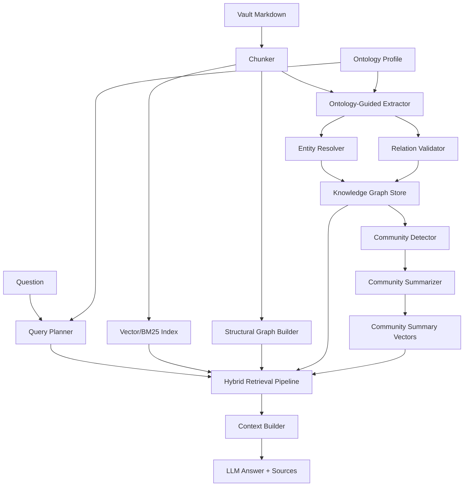

# Superpower-Inside Full GraphRAG + Ontology 기술 설계서

> 작성일: 2026-05-27  
> 기준 브랜치: `feat/chat-research-copilot`  
> 대상: Obsidian 데스크톱 플러그인의 RAG를 단순 벡터 검색에서 온톨로지 기반 지식 그래프 검색으로 고도화

## 1. 결론

이 설계는 기존 RAG를 대체하지 않고, 그 위에 다음 계층을 순서대로 얹는다.

1. **Retrieval Pipeline**: vector, BM25, ANN, 구조 그래프, GraphRAG 후보를 같은 계약으로 통합한다.
2. **Ontology Layer**: 엔티티 타입, 관계 타입, 속성, 제약, alias, merge 규칙을 명시적으로 관리한다.
3. **Knowledge Graph Store**: 온톨로지로 정규화된 entity, relation, claim, evidence, community를 저장한다.
4. **Full GraphRAG**: local search, global/community search, ontology-guided traversal, hybrid rank fusion을 제공한다.
5. **Obsidian UX**: 명시적 인덱싱, 진행률, 취소, partial resume, stale 상태, 비용 예측을 제공한다.

핵심 판단은 다음과 같다.

- **ANN과 구조 그래프는 기본 고급 검색 기능으로 도입할 가치가 높다.**
- **Full GraphRAG는 모든 vault에 기본 적용할 기능이 아니라, 명시적으로 켜는 고급 인덱싱 기능이다.**
- **Full Ontology 없이 GraphRAG만 넣으면 장기적으로 타입과 관계명이 흩어져 검색 품질이 불안정해진다.**
- **따라서 GraphRAG는 반드시 Ontology Layer 위에서만 production 기능으로 노출한다.**

## 2. 현재 문제

현재 RAG는 `VectorStore.query()`에서 전체 벡터를 스캔한다. IndexedDB를 사용해도 query 시 모든 entry를 읽어 코사인 유사도를 계산하므로 청크 수가 늘수록 검색 지연이 선형 증가한다. BM25가 켜져도 파일 단위 후보를 chunk 후보로 바꾸기 위해 전체 entry를 다시 읽는 경로가 있다.

품질 측면에서는 다음 한계가 있다.

- 벡터 검색은 질문과 표면적으로 유사한 chunk를 잘 찾지만, 간접 관계와 추상 질의에 약하다.
- BM25는 명시 키워드에는 강하지만 동의어, 별칭, 개념 계층을 모른다.
- Obsidian 링크와 heading 구조는 현재 지식 그래프로 충분히 활용되지 않는다.
- LLM이 추출한 entity/relation을 저장하더라도 온톨로지가 없으면 `person`, `Person`, `human`, `인물`처럼 타입이 갈라진다.
- 관계도 `supports`, `supports_argument`, `argues_for`, `긍정한다`처럼 분산되어 query와 merge 품질이 떨어진다.

이 문서는 단순 “Entity GraphRAG”가 아니라 **온톨로지로 통제되는 지식 그래프 RAG**를 목표로 한다.

## 3. 목표와 비목표

### 목표

- 대형 vault에서 vector 검색의 전체 스캔 의존도를 줄인다.
- Obsidian 링크, 백링크, heading 구조를 검색 후보 확장에 활용한다.
- LLM 추출 결과를 온톨로지에 맞춰 정규화한다.
- domain별 ontology profile을 제공한다.
- entity, relation, claim, evidence, community를 독립 저장한다.
- local GraphRAG와 global GraphRAG를 모두 지원한다.
- 인덱싱 비용, 시간, 실패 상태를 사용자가 이해하고 통제할 수 있게 한다.
- 모든 고급 검색 기능은 기존 vector/BM25 RAG로 폴백할 수 있어야 한다.

### 비목표

- 모바일 Obsidian 지원은 목표로 하지 않는다.
- 외부 서버, 웹 크롤링, 쿠키 기반 수집은 도입하지 않는다.
- GraphRAG를 기존 RAG의 필수 경로로 만들지 않는다.
- v1에서 OWL/RDF/SPARQL 전체 호환을 목표로 하지 않는다.
- 사용자가 직접 온톨로지를 작성하지 않아도 기본값으로 동작해야 한다.

## 4. 사용자 가치

| 기능 | 사용자가 얻는 결과 | 비용 |
| --- | --- | --- |
| ANN 검색 | 대형 vault에서 채팅 전 검색 대기 시간이 줄어든다 | CPU/디스크 소폭 증가 |
| 구조 그래프 | 링크, 백링크, heading 주변 문맥이 답변에 반영된다 | LLM 비용 없음 |
| Ontology | 같은 개념/인물/관계가 일관되게 병합된다 | 설계와 검증 복잡도 증가 |
| Local GraphRAG | 특정 entity 주변의 관계와 근거를 찾는다 | 초기 LLM 추출 비용 큼 |
| Global GraphRAG | vault 전체의 반복 주제, 논쟁, 구조를 요약한다 | community summary 비용 큼 |
| Claim/Evidence | 답변이 어떤 문장과 관계에 근거하는지 설명 가능하다 | 저장소와 UI 복잡도 증가 |

## 5. Vault 적합성

### 잘 맞는 vault

| Vault 유형 | 이유 |
| --- | --- |
| 연구 노트, 논문 노트 | 개념, 주장, 근거, 저자, 방법론 관계가 중요하다 |
| 신학, 성경, 철학, 역사 노트 | 인물, 사건, 장소, 교리, 논쟁 관계가 반복된다 |
| 법률, 정책, 규정 문서 | 조항, 기관, 사건, 근거, 예외 관계가 구조화된다 |
| 장기 PKM/Zettelkasten | 링크와 개념 계층을 활용할 수 있다 |
| 1,000청크 이상 대형 vault | 인덱싱 비용을 반복 질의로 회수할 수 있다 |

### 피하는 게 나은 vault

| Vault 유형 | 이유 |
| --- | --- |
| 500청크 미만 작은 vault | exact vector/BM25로 충분하다 |
| daily note와 task 중심 vault | 관계 그래프의 신호보다 노이즈가 크다 |
| 매우 자주 바뀌는 임시 작업 vault | GraphRAG stale/rebuild 비용이 크다 |
| 링크와 heading이 거의 없는 vault | 구조 그래프 이득이 작다 |
| 민감한 자료 + 원격 LLM 사용 | 대량 본문이 외부 모델로 전송될 수 있다 |

## 6. 전체 아키텍처



계층별 책임은 분리한다.

| 계층 | 책임 |
| --- | --- |
| `VectorStore` | chunk vector 영속화와 기본 조회 |
| `CandidateProvider` | vector, BM25, ANN, structural, graph 후보 생성 |
| `OntologyRegistry` | ontology profile, 타입, 관계, 제약, alias 규칙 제공 |
| `KnowledgeGraphStore` | entity, relation, claim, evidence, community 저장 |
| `GraphRagIndexer` | ontology-guided extraction, merge, validation, community build |
| `GraphRagQueryEngine` | local/global/drift-style graph retrieval |
| `RagRetrievalPipeline` | 후보 병합, rank fusion, timeout, fallback |

## 7. Ontology Layer

### 목적

Ontology Layer는 LLM 추출 결과를 통제한다. 이 계층이 없으면 GraphRAG는 “그때그때 LLM이 만든 JSON 모음”에 가까워지고, 장기적으로 검색 품질이 떨어진다.

온톨로지는 다음을 제공한다.

- 허용 entity type 목록
- 허용 relation type 목록
- 타입별 속성 스키마
- 관계별 domain/range 제약
- alias와 canonicalization 규칙
- merge 정책
- confidence threshold
- domain profile
- ontology versioning
- stale/migration 정책

### 핵심 타입

```ts
export interface OntologyProfile {
  id: string;
  name: string;
  version: number;
  locale: 'ko' | 'en' | 'mixed';
  entityTypes: OntologyEntityType[];
  relationTypes: OntologyRelationType[];
  claimTypes: OntologyClaimType[];
  aliasRules: OntologyAliasRule[];
  mergeRules: OntologyMergeRule[];
  extractionGuidelines: string;
}

export interface OntologyEntityType {
  id: string;
  label: string;
  description: string;
  parentTypeId?: string;
  properties: OntologyProperty[];
  examples: string[];
}

export interface OntologyRelationType {
  id: string;
  label: string;
  description: string;
  sourceTypeIds: string[];
  targetTypeIds: string[];
  inverseRelationTypeId?: string;
  symmetric?: boolean;
  transitive?: boolean;
  properties: OntologyProperty[];
  examples: string[];
}

export interface OntologyProperty {
  id: string;
  valueType: 'string' | 'number' | 'boolean' | 'date' | 'enum';
  required: boolean;
  enumValues?: string[];
}
```

### 기본 ontology profiles

초기 production profile은 세 단계로 제공한다.

| Profile | 대상 | 설명 |
| --- | --- | --- |
| `general` | 일반 vault | 인물, 조직, 장소, 문서, 개념, 사건, 주장 |
| `academic-research` | 논문/연구 | 저자, 논문, 방법론, 데이터셋, 주장, 근거, 반론 |
| `biblical-studies` | 성경/신학 | 인물, 장소, 책, 장, 절, 사건, 교리, 상징, 해석, 논쟁 |

사용자는 vault 전체 profile을 하나 고르고, 나중에 폴더별 override를 설정할 수 있다. v1에서는 profile 편집 UI를 최소화하고, JSON import/export를 먼저 제공한다.

### `general` profile 기본 타입

| Entity type | 설명 |
| --- | --- |
| `person` | 사람, 저자, 역사 인물 |
| `organization` | 기관, 단체, 종파, 학교 |
| `place` | 장소, 지역, 국가 |
| `work` | 책, 논문, 문서, 작품 |
| `concept` | 개념, 주제, 이론 |
| `event` | 사건, 회의, 전쟁, 변화 |
| `argument` | 주장, 논증, 해석 |
| `evidence` | 근거, 인용, 사례 |

### `general` profile 기본 관계

| Relation type | Source | Target | 설명 |
| --- | --- | --- | --- |
| `authored` | `person` | `work` | 저작 관계 |
| `mentions` | any | any | 언급 관계 |
| `supports` | `evidence`/`argument` | `argument`/`concept` | 지지 |
| `opposes` | `argument` | `argument`/`concept` | 반대 |
| `collaborated_with` | any | any | 협력 |
| `causes` | `event`/`concept` | `event`/`concept` | 원인 |
| `influences` | any | any | 영향 |
| `part_of` | any | any | 포함 관계 |
| `located_in` | `event`/`organization` | `place` | 위치 |
| `interprets` | `argument` | `work`/`concept` | 해석 |

### `biblical-studies` profile 확장

| Entity type | 설명 |
| --- | --- |
| `biblical_person` | 성경 인물 |
| `biblical_place` | 성경 지명 |
| `biblical_book` | 성경 각 권 |
| `biblical_passage` | 장/절 범위 |
| `theological_concept` | 교리, 신학 개념 |
| `covenant` | 언약 |
| `prophecy` | 예언 |
| `ritual` | 제사, 절기, 의식 |
| `interpretation` | 해석 관점 |

| Relation type | 설명 |
| --- | --- |
| `descended_from` | 계보 |
| `covenant_with` | 언약 관계 |
| `prophesies_about` | 예언 대상 |
| `fulfills` | 성취 관계 |
| `prefigures` | 예표 관계 |
| `quotes_passage` | 본문 인용 |
| `interprets_passage` | 본문 해석 |
| `contrasts_with` | 대비 |

### 온톨로지 검증

LLM 추출 결과는 저장 전 반드시 검증한다.

1. entity type이 profile에 존재하는지 확인한다.
2. relation type이 profile에 존재하는지 확인한다.
3. relation source/target type이 domain/range 제약을 만족하는지 확인한다.
4. 필수 속성이 있는지 확인한다.
5. confidence threshold를 적용한다.
6. alias/canonicalization 후 기존 entity와 merge 후보를 찾는다.
7. 검증 실패 record는 폐기하지 않고 `rejectedGraphFacts`에 저장해 디버깅 가능하게 한다.

## 8. Knowledge Graph 데이터 모델

GraphRAG는 단순 entity/relation만으로 부족하다. 답변 가능성과 출처 설명을 위해 claim과 evidence를 분리한다.

```ts
export interface GraphEntityRecord {
  id: string;
  ontologyProfileId: string;
  ontologyVersion: number;
  typeId: string;
  canonicalName: string;
  aliases: string[];
  description: string;
  properties: Record<string, string | number | boolean>;
  confidence: number;
  evidenceIds: string[];
  createdAt: number;
  updatedAt: number;
}

export interface GraphRelationRecord {
  id: string;
  ontologyProfileId: string;
  ontologyVersion: number;
  relationTypeId: string;
  sourceEntityId: string;
  targetEntityId: string;
  description: string;
  properties: Record<string, string | number | boolean>;
  confidence: number;
  evidenceIds: string[];
  createdAt: number;
  updatedAt: number;
}

export interface GraphClaimRecord {
  id: string;
  claimTypeId: string;
  text: string;
  entityIds: string[];
  relationIds: string[];
  stance?: 'supports' | 'opposes' | 'neutral' | 'interprets';
  confidence: number;
  evidenceIds: string[];
  updatedAt: number;
}

export interface GraphEvidenceRecord {
  id: string;
  filePath: string;
  entryId: string;
  startLine: number;
  endLine?: number;
  quote: string;
  contentHash: string;
  extractionModelKey: string;
  updatedAt: number;
}

export interface GraphCommunityRecord {
  id: string;
  ontologyProfileId: string;
  title: string;
  entityIds: string[];
  relationIds: string[];
  claimIds: string[];
  summary: string;
  summaryVector: number[];
  level: number;
  parentCommunityId?: string;
  updatedAt: number;
}
```

### IndexedDB schema

```ts
this.version(4).stores({
  graphEntities: 'id, ontologyProfileId, typeId, canonicalName, updatedAt',
  graphRelations: 'id, ontologyProfileId, relationTypeId, sourceEntityId, targetEntityId, updatedAt',
  graphClaims: 'id, claimTypeId, updatedAt',
  graphEvidence: 'id, filePath, entryId, contentHash, updatedAt',
  graphCommunities: 'id, ontologyProfileId, level, parentCommunityId, updatedAt',
  graphRejectedFacts: 'id, filePath, reason, updatedAt',
  ontologyProfiles: 'id, version, updatedAt',
  ontologyAliases: 'id, ontologyProfileId, normalizedName',
});
```

JSON 저장소는 대형 graph에 부적합하다. JSON vector store 사용자는 기존 RAG는 그대로 쓸 수 있지만, GraphRAG는 IndexedDB를 권장한다. 대형 vault에서는 GraphRAG를 JSON으로 저장하지 않는다.

## 9. Ontology-Guided Extraction

### 목적

Extractor는 LLM에게 “자유롭게 entity를 뽑아라”가 아니라 “현재 ontology profile에 맞춰 추출하라”고 지시한다.

입력에는 다음이 포함된다.

- chunk text
- file path
- heading
- 주변 heading context
- ontology profile의 entity/relation/claim schema
- 이미 알려진 alias 후보
- 추출 예시

출력은 JSON object만 허용한다.

```json
{
  "entities": [
    {
      "name": "Paul",
      "typeId": "biblical_person",
      "description": "Apostle and missionary",
      "aliases": ["Saul"],
      "confidence": 0.86
    }
  ],
  "relations": [
    {
      "source": "Paul",
      "target": "Barnabas",
      "relationTypeId": "collaborated_with",
      "description": "They traveled together during early missions",
      "confidence": 0.78
    }
  ],
  "claims": [
    {
      "text": "Paul's mission emphasizes the expansion of the gospel to Gentiles.",
      "claimTypeId": "interpretive_claim",
      "entityNames": ["Paul", "Gentiles"],
      "stance": "interprets",
      "confidence": 0.73
    }
  ]
}
```

### 추출 단위

기본 단위는 chunk다. 다만 file 단위 요약 추출도 별도 단계로 둔다.

| 단계 | 입력 | 목적 |
| --- | --- | --- |
| chunk extraction | 개별 chunk | entity, relation, claim, evidence 추출 |
| file consolidation | 한 파일의 추출 결과 | alias merge, 중복 relation 병합 |
| vault consolidation | 전체 graph | canonical entity merge, community build |
| community summarization | community | global search용 summary 생성 |

### 비용 통제

- `graphRagEnabled` 기본값은 `false`.
- GraphRAG 인덱싱은 자동 RAG 인덱싱과 분리한다.
- 실행 전 예상 LLM 호출 수, 예상 토큰, 예상 비용 범위를 표시한다.
- 기본 `graphRagMaxFilesPerRun`은 50으로 시작한다.
- 로컬 Ollama는 동시성 1로 고정한다.
- remote provider도 기본 동시성 1, 사용자가 명시적으로 올릴 때만 2 이상 허용한다.
- 파일 content hash, ontology version, extraction model key가 같으면 재추출하지 않는다.

## 10. Entity Resolution과 Merge

GraphRAG 품질의 핵심은 중복 entity 병합이다.

### merge 후보 생성

1. normalized canonical name exact match
2. alias exact match
3. 같은 file 또는 같은 community 안의 유사 이름
4. entity description embedding 유사도
5. ontology type 호환성

### merge 점수

```text
mergeScore =
  0.35 * nameScore +
  0.25 * aliasScore +
  0.20 * descriptionVectorScore +
  0.10 * ontologyTypeScore +
  0.10 * coOccurrenceScore
```

기본 정책:

- `mergeScore >= 0.88`: 자동 merge
- `0.72 <= mergeScore < 0.88`: pending merge로 저장
- `< 0.72`: 별도 entity 유지

pending merge는 설정 UI에서 나중에 검토할 수 있다. v1에서는 대량 merge UI를 만들지 않고, pending 목록과 “자동 merge threshold 조정”만 제공한다.

## 11. Full GraphRAG Query

GraphRAG query는 질문 유형에 따라 local, global, hybrid로 나뉜다.

### Query Planner

질문을 다음 유형으로 분류한다.

| Query type | 예시 | 주요 검색 |
| --- | --- | --- |
| factual | “바울과 바나바는 어떤 관계야?” | local entity neighborhood |
| relational | “A와 협력하거나 대립한 인물” | relation traversal |
| thematic | “반복되는 핵심 논쟁은?” | community summary |
| comparative | “두 해석의 차이는?” | claim/relation 비교 |
| source-seeking | “어디에 근거가 있어?” | evidence-first retrieval |
| ordinary-rag | 일반 질문 | vector/BM25 우선 |

LLM을 query planner hot path에 기본 사용하지 않는다. 초기 구현은 규칙과 embedding 기반으로 분류하고, 고급 옵션에서만 질문 엔티티 추출 LLM을 허용한다.

### Local GraphRAG

Local GraphRAG는 특정 entity 주변을 탐색한다.

1. 질문에서 entity mention 후보를 찾는다.
2. canonical entity와 alias를 lookup한다.
3. 1-hop relation을 가져온다.
4. relation type별 weight를 적용한다.
5. 관련 claim과 evidence를 가져온다.
6. 원본 chunk를 retrieval candidate로 변환한다.

사용 예:

- “바울과 바나바의 관계”
- “이 주제에 반대하는 주장”
- “이 교리와 연결된 본문”

### Global GraphRAG

Global GraphRAG는 community summary를 사용한다.

1. 질문 임베딩으로 community summary vector를 검색한다.
2. 상위 community의 대표 entity/relation/claim을 가져온다.
3. community summary와 원본 evidence chunk를 함께 후보로 만든다.
4. 필요하면 상위 community에서 하위 community로 내려간다.

사용 예:

- “이 vault에서 반복되는 갈등 구조”
- “성경 노트 전체의 주요 주제”
- “연구 노트에서 가장 자주 등장하는 논쟁”

### Hybrid GraphRAG

최종 검색은 graph만 사용하지 않는다. 다음 source를 rank fusion한다.

| Source | 역할 |
| --- | --- |
| vector | 의미 유사도 기본 후보 |
| BM25 | 키워드 정확도 보강 |
| ANN | 대형 vault vector 후보 가속 |
| structural | 링크/백링크/heading 확장 |
| graph-local | entity 주변 관계 검색 |
| graph-global | community summary 검색 |
| evidence | 출처 중심 근거 검색 |

초기 fusion은 Reciprocal Rank Fusion을 사용한다. graph 후보는 단독으로 답변을 지배하지 않고, evidence와 원본 chunk가 있는 후보를 우선한다.

## 12. ANN과 구조 그래프의 위치

ANN과 구조 그래프는 Full GraphRAG의 하위 기능이 아니라, 독립 검색 source다.

### ANN

- 500청크 미만은 exact vector 유지.
- 500~10,000청크는 IVF build 허용.
- 10,000청크 이상은 ANN 우선.
- 50,000청크 이상은 exact fallback을 제한한다.

IVF는 `sqrt(entryCount)` centroid를 기본으로 하되 최대 128개로 제한한다. 대형 vault에서는 full k-means보다 sampled 또는 mini-batch build를 우선 검토한다.

### 구조 그래프

Obsidian `metadataCache.resolvedLinks`, `getFileCache(file)?.links`, `getFileCache(file)?.headings`를 사용한다.

- 파일 직접 읽기를 hot path에 넣지 않는다.
- metadata cache가 없으면 다음 debounce cycle에서 재시도한다.
- heading parent/sibling/child를 chunk 후보로 확장한다.
- outgoing/incoming link 주변 chunk를 후보로 확장한다.

구조 그래프는 LLM 비용 없이 품질을 올릴 수 있으므로 GraphRAG보다 먼저 구현한다.

## 13. 설정

```ts
interface RAGConfig {
  annEnabled: boolean;
  annClusterCount: number;
  annProbeCount: number;
  structuralGraphEnabled: boolean;
  graphRagEnabled: boolean;
  graphRagModel: string;
  graphRagMaxFilesPerRun: number;
  ontologyEnabled: boolean;
  ontologyProfileId: string;
  ontologyFolderOverrides: OntologyFolderOverride[];
  ontologyAutoMergeThreshold: number;
  ontologyPendingMergeThreshold: number;
  graphRagQueryMode: 'auto' | 'local' | 'global' | 'hybrid';
}

interface OntologyFolderOverride {
  folderPath: string;
  ontologyProfileId: string;
  includeSubfolders: boolean;
}
```

기본값:

```ts
annEnabled: true;
annClusterCount: 0;
annProbeCount: 4;
structuralGraphEnabled: true;
ontologyEnabled: true;
ontologyProfileId: 'general';
ontologyFolderOverrides: [];
ontologyAutoMergeThreshold: 0.88;
ontologyPendingMergeThreshold: 0.72;
graphRagEnabled: false;
graphRagModel: '';
graphRagMaxFilesPerRun: 50;
graphRagQueryMode: 'auto';
```

`ontologyEnabled: true`는 비용이 큰 작업을 자동 실행한다는 뜻이 아니다. ontology profile과 검증 규칙을 준비한다는 뜻이다. 실제 GraphRAG 추출은 `graphRagEnabled`와 명시적 인덱싱 버튼으로만 시작한다.

## 14. 설정 UI

RAG 설정에는 다음 섹션을 둔다.

1. **기본 검색**
   - vector store 상태
   - BM25 상태
   - 총 파일/청크 수

2. **빠른 검색**
   - ANN 토글
   - centroid 수
   - probe 수
   - 마지막 build 시간
   - stale 여부

3. **구조 그래프**
   - 구조 그래프 토글
   - file node 수
   - heading node 수
   - 링크 edge 수

4. **온톨로지**
   - profile 선택
   - profile 설명
   - entity type 수
   - relation type 수
   - folder override
   - pending merge 수

5. **그래프 RAG 인덱싱**
   - 활성화 토글
   - 모델 선택
   - 예상 파일 수
   - 예상 LLM 호출 수
   - 예상 토큰/비용 범위
   - 시작, 취소, 이어서 실행
   - 실패 파일 목록

6. **성능 보호**
   - `normal`, `throttled`, `paused`
   - 현재 batch size
   - 현재 yield
   - 최근 timeout source

설정 탭의 숫자 입력은 프로젝트 관례대로 slider가 아니라 number text input을 사용한다.

## 15. 상태 모델

GraphRAG와 ontology는 같은 상태 모델을 공유한다.

| 상태 | 의미 |
| --- | --- |
| `not-built` | 아직 graph index가 없다 |
| `building` | 인덱싱 중이다 |
| `ready` | 현재 provider/model/ontology 기준 사용 가능하다 |
| `partial` | 일부 파일 실패 또는 취소 상태다 |
| `stale` | 파일, 모델, ontology version 변경으로 재빌드가 필요하다 |
| `disabled` | 설정에서 꺼져 있다 |
| `schema-error` | IndexedDB schema 또는 migration 실패 |

`partial` 상태에서도 성공한 파일의 graph는 query에 참여할 수 있다. 실패 파일은 기존 vector/BM25 검색에 맡긴다.

## 16. 성능과 리소스 예산

### 인덱싱 비용

| 기능 | 비용 주체 | 예상 |
| --- | --- | --- |
| Vector RAG | embedding API 또는 local embedding | 낮음 |
| ANN build | local CPU | 중간 |
| 구조 그래프 | metadataCache + IndexedDB | 낮음 |
| Ontology validation | local CPU | 낮음~중간 |
| Entity/Relation extraction | LLM 호출 | 높음 |
| Community summary | LLM 호출 + embedding | 중간~높음 |

GraphRAG에서 가장 비싼 부분은 임베딩이 아니라 LLM 추출이다. `text-embedding-3-small` 임베딩 비용은 낮지만, 청크별 entity/relation/claim 추출은 입력/출력 토큰이 모두 발생한다.

### query deadline

| 단계 | 기본 예산 | 초과 시 처리 |
| --- | ---: | --- |
| 질문 임베딩 | provider 의존 | 실패 시 RAG 없이 일반 채팅 |
| vector/ANN | 300ms | 후보 수 축소 또는 fallback |
| BM25 | 80ms | BM25 생략 |
| structural | 30ms | 구조 후보 생략 |
| graph-local | 180ms | local graph 생략 |
| graph-global | 250ms | global graph 생략 |
| fusion | 20ms | 후보 cap 축소 |

GraphRAG timeout은 사용자 경고가 아니라 graceful degradation이다. 설정 UI와 console diagnostic에만 기록한다.

### vault 크기별 자동 전략

| 규모 | 기준 | 기본 전략 |
| --- | --- | --- |
| small | 500청크 미만 | exact vector, 구조 그래프만 가볍게 사용 |
| medium | 500~10,000청크 | ANN 허용, GraphRAG 명시 실행 |
| large | 10,000청크 이상 | ANN 우선, GraphRAG run limit 유지 |
| huge | 50,000청크 이상 | GraphRAG 폴더 단위 권장, exact fallback 제한 |

## 17. 보안과 개인정보

GraphRAG는 vault 본문을 대량으로 LLM에 보낸다. 따라서 UI에서 다음을 명확히 표시한다.

- 어떤 provider/model로 추출하는지
- 몇 개 파일과 청크가 전송될지
- 민감 경로가 제외되는지
- chat 저장 폴더와 attachments 제외 여부
- local Ollama 사용 시 외부 전송이 없다는 점
- remote provider 사용 시 본문 전송이 발생한다는 점

기본 제외 경로는 기존 RAG 설정을 따른다.

- `.git`
- `node_modules`
- `.obsidian`
- `attachments`
- chat save folder
- 사용자가 지정한 exclude path/ext

## 18. 장애 처리

| 상황 | 처리 |
| --- | --- |
| ontology profile 없음 | `general` profile로 fallback |
| ontology version 변경 | graph stale 표시 |
| relation domain/range 불일치 | rejected fact로 저장 |
| JSON 파싱 실패 | 해당 chunk 실패 기록 |
| LLM 호출 실패 | 파일 실패 기록, 다음 파일 진행 |
| merge 충돌 | pending merge로 보류 |
| IndexedDB 실패 | 고급 source 비활성화, 기존 RAG 유지 |
| graph timeout | 해당 query에서 graph 후보 제외 |

사용자 질의는 어떤 실패 상황에서도 빈 응답으로 끝나지 않아야 한다. 최소한 기존 vector/BM25 또는 일반 채팅으로 진행한다.

## 19. 테스트 전략

### 단위 테스트

- `ontology/profile.test.ts`
  - profile schema validation
  - relation domain/range 검증
  - alias normalization

- `ontology/validator.test.ts`
  - 정상 추출 결과 저장 가능
  - 알 수 없는 type/relation reject
  - 필수 속성 누락 reject

- `graph/entity-resolver.test.ts`
  - exact alias merge
  - type 불일치 merge 방지
  - pending merge threshold 검증

- `graph/query-planner.test.ts`
  - factual/relational/thematic/source-seeking 분류

- `graph/query-engine.test.ts`
  - local graph traversal
  - community summary 검색
  - evidence 후보 생성

- `rag/query-pipeline.test.ts`
  - vector/BM25/structural/graph 후보 fusion
  - graph 비활성 시 기존 RAG 동등성

### 통합 테스트

- `.test-vault` 성경 corpus에서 `biblical-studies` profile로 일부 폴더 인덱싱
- “바울과 관련된 인물”
- “반복되는 언약 구조”
- “서로 대립하는 해석”
- “이 주장 근거가 어디에 있어?”
- provider/model 변경 시 graph stale 처리
- ontology profile 변경 시 stale 처리
- 취소 후 partial resume

### 검증 명령

```fish
npm run lint
npm run typecheck
npm run test
npm run build
```

Obsidian 런타임 QA는 `.test-vault`에서 별도로 수행한다.

## 20. 구현 단계

Full GraphRAG와 Full Ontology를 한 번에 노출하지 않는다. production slice는 다음 순서로 자른다.

### Slice 1. Retrieval Pipeline 분리

- `RagRetrievalPipeline`
- `ExactVectorCandidateProvider`
- source별 deadline
- diagnostic
- 기존 결과 동등성 테스트

완료 조건:

- GraphRAG/ANN 비활성 상태에서 기존 RAG와 결과가 동등하다.
- timeout이 query 전체 실패로 전파되지 않는다.

### Slice 2. ANN과 BM25 lookup 최적화

- `filePath -> entryIds` lookup
- `IvfVectorCandidateProvider`
- ANN build/query 상태
- recall 측정

완료 조건:

- 1,000청크 이상에서 exact 대비 후보 생성이 빨라진다.
- 500청크 미만에서는 exact가 유지된다.

### Slice 3. 구조 그래프

- Obsidian metadataCache 기반 link/heading graph
- seed chunk 주변 후보 확장
- source reason

완료 조건:

- LLM 호출 없이 링크/백링크/heading 후보가 추가된다.
- RAG 제외 경로를 준수한다.

### Slice 4. Ontology Registry

- `general` profile
- `biblical-studies` profile
- profile schema validation
- relation domain/range validation
- settings UI profile 선택

완료 조건:

- ontology profile만 바꿔도 추출 schema와 validator가 달라진다.
- GraphRAG 추출 전 비용 없이 준비된다.

### Slice 5. Ontology-Guided Extraction

- chunk extraction
- JSON parser
- rejected fact 저장
- evidence 저장
- file hash/model/profile cache

완료 조건:

- LLM 결과가 ontology에 맞지 않으면 저장되지 않는다.
- 실패 chunk가 전체 인덱싱을 중단하지 않는다.

### Slice 6. Entity Resolution

- canonical name normalization
- alias merge
- threshold 기반 auto/pending merge
- merge diagnostic

완료 조건:

- 같은 entity가 과도하게 중복 저장되지 않는다.
- 애매한 merge는 자동 처리하지 않는다.

### Slice 7. GraphRAG Query

- local graph search
- global community search
- evidence-first search
- hybrid fusion

완료 조건:

- factual, relational, thematic query에서 graph 후보가 참여한다.
- graph timeout 시 기존 RAG로 폴백한다.

### Slice 8. 운영 UI

- graph status
- ontology status
- estimated cost
- progress/cancel/resume
- stale/rebuild 안내
- pending merge count

완료 조건:

- 사용자가 비용과 상태를 이해하고 실행/중단/재개할 수 있다.

## 21. 도입 정책

기본값은 다음 철학을 따른다.

- Obsidian 실행을 느리게 만들지 않는다.
- vault 열기 시 대형 graph를 eager load하지 않는다.
- 장시간 LLM 작업은 사용자가 버튼을 눌러야 시작한다.
- 고급 인덱스가 stale이면 조용히 제외하고 기존 RAG를 사용한다.
- GraphRAG 결과는 반드시 evidence와 함께 표시한다.
- 온톨로지는 기본 제공하되, 사용자에게 복잡한 편집을 강요하지 않는다.

## 22. 최종 판단

이 플러그인에 “Full GraphRAG + Full Ontology”를 넣는 것은 가능하지만, 기본 RAG 기능처럼 가볍게 취급하면 안 된다. 올바른 제품 형태는 다음이다.

1. **기본 사용자**는 vector/BM25/구조 그래프만으로 빠르고 안전하게 쓴다.
2. **대형 vault 사용자**는 ANN으로 검색 대기 시간을 줄인다.
3. **연구 vault 사용자**는 ontology profile을 선택하고 GraphRAG 인덱싱을 명시적으로 실행한다.
4. **전문 domain 사용자**는 folder별 ontology override와 pending merge 검토로 품질을 높인다.

따라서 이 계획의 중심은 GraphRAG 자체가 아니라 **온톨로지로 통제되는 GraphRAG를 Obsidian 데스크톱 앱 안에서 안전하게 운영하는 것**이다.
